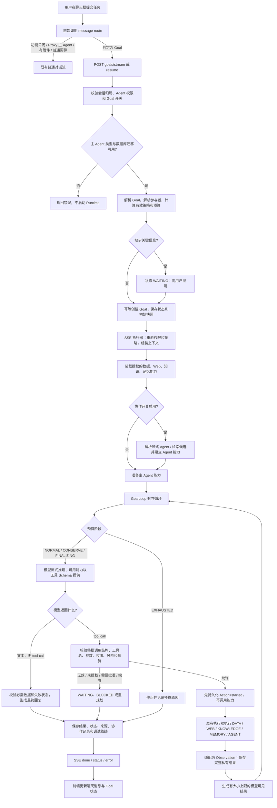
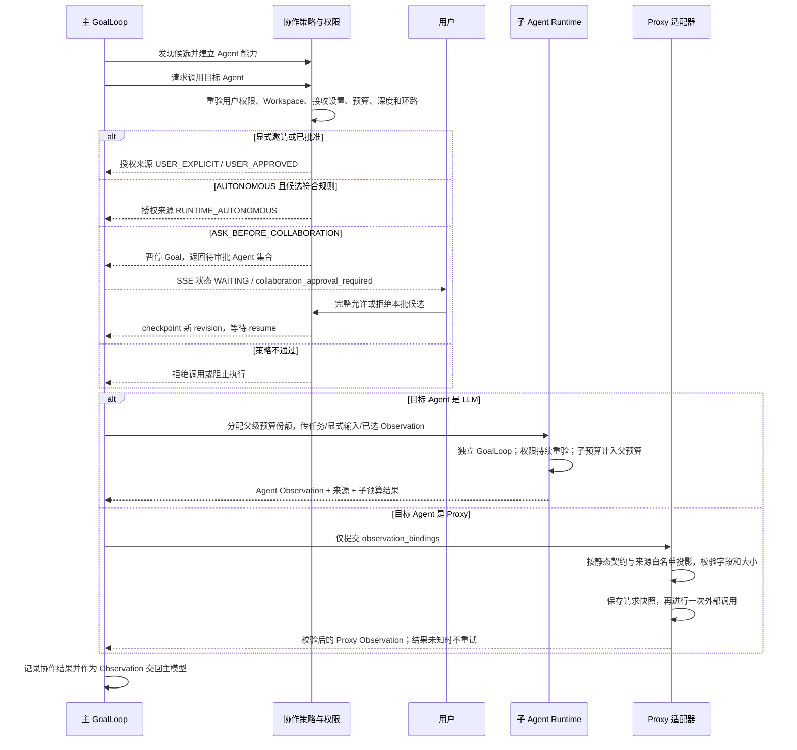

# AgentRuntime 当前执行流程

本文按当前代码说明 AgentRuntime（代码中的 Goal Runtime）的实际执行路径。入口主要位于 `api/goals.py`；循环执行由 `runtime/loop.py` 完成；Agent 协作和 Proxy 投影是可选分支。功能是否进入此路径仍由 `config.yaml` 的 `goal_execution_enabled`、`goal_collaboration_enabled`、`goal_proxy_enabled` 控制。

## 一、端到端流程图

### 协作子流程

## 二、每一步的详细逻辑

### 1. 聊天入口决定是否走 Goal Runtime

前端发送前调用 `POST /api/conversations/{id}/message-route`。后端先确认当前用户拥有会话并且有权使用该 Agent，然后根据以下条件判断：

- `goal_execution_enabled` 必须严格为 `true`；主 Agent 必须是 LLM 类型；有附件时走普通对话。
- 用确定性解析器 `parse_goal()` 识别显式目标、成功标准、参与者等，再结合任务动作词判断是否像一个待完成任务。
- 闲聊问候直接走普通对话；显式协作还要求 `goal_collaboration_enabled=true`。
- 若路由检查失败，前端会停止发送并提示错误；若返回 `use_goal=false`，原有普通对话路径保持不变。

该步骤只是选执行通道，不会调用模型，也不授予任何能力权限。`@Agent` 候选是否在前端被选中，与后端再次检查参与者授权是两回事。

代码：[Chat.vue](../frontend/src/views/Chat.vue)、[api/index.js](../frontend/src/api/index.js)、[goals.py](../src/agentdevstu/api/goals.py)、[goals.py parser](../src/agentdevstu/runtime/goals.py)

### 2. 创建 Goal、解析输入并做前置校验

`POST /api/conversations/{id}/goals/stream` 会重新验证会话所有权和 Agent 使用权，不依赖前端路由结果。入口只支持 LLM 主 Agent；Proxy Agent 作为主 Agent 时返回冲突错误。还会检查 Goal 功能开关、Workspace 的运行策略字段和 `t_runtime_goals` 表是否已准备好；这里不会自动运行数据库迁移。

解析器保留原始用户文本作为任务目标，只把明确标注的“目标、对象、约束、成功标准、输出”和 JSON 对象输入提取为结构化字段。它不会用模型猜测缺失参数。参数缺口或语义不清时，状态设为 `WAITING / clarify_goal / ASK_USER`，等待用户补充。

如果启用了目标协作，系统会把用户显式选择的 Agent ID 和 `@名称`解析成同一 Workspace 内可用、用户有权使用且允许接收协作的 Agent。参与者数量、最小模型调用数、步骤数、Agent 深度及预算不足都会在启动前拒绝。相同幂等键和相同请求返回原 Goal；同一幂等键对应不同请求时返回冲突，避免重复启动。

代码：[goals.py](../src/agentdevstu/api/goals.py)、[store.py](../src/agentdevstu/runtime/store.py)、[state.py](../src/agentdevstu/runtime/state.py)

### 3. 解析并锁定运行策略与预算

`resolve_effective_policy()` 合并 Platform、Workspace、Agent、Goal 四层策略。Platform 提供硬上限；Workspace 可配置自己的限额；Agent 和单次 Goal 只能进一步收紧前一层限额，不能突破硬上限。协作自治等级同样按最严格层生效：`EXPLICIT_ONLY`、`ASK_BEFORE_COLLABORATION`、`AUTONOMOUS`。

预算覆盖总时长、模型调用、工具调用、Web 调用、Agent 调用、协作者数、递归深度、步骤、重规划、失败次数、上下文和输出。Goal 状态会保存策略来源、初始限额和已用额度。恢复时重新读取当前策略，限额只会收紧，不重置已消耗额度。

代码：[policy.py](../src/agentdevstu/runtime/policy.py)、[state.py](../src/agentdevstu/runtime/state.py)

### 4. 持久化 Goal 与执行快照

创建时先将原始请求写入既有会话消息，再创建 `RuntimeGoal` 记录并保存初始状态、幂等键、revision 和快照引用。结构化状态及索引信息放在数据库；较大的消息、Observation、缓存、协作与运行数据保存在 `data/runtime_goals/<goal_id>/` 下的不可变 JSON 快照中。快照使用随机文件名、权限限制、SHA-256 和大小上限；数据库事务只引用已写入的快照。

每次 checkpoint 会更新快照和数据库 revision，并以旧 revision 做条件更新；并发修改时拒绝写入，避免把较新的状态覆盖掉。Action 在外部调用前先写入 `started` 状态。进程中断或外部调用结果不确定时，状态会标记 `unknown`，恢复流程不会盲目重放该调用。

代码：[store.py](../src/agentdevstu/runtime/store.py)、[artifacts.py](../src/agentdevstu/runtime/artifacts.py)、[models.py](../src/agentdevstu/runtime/models.py)

### 5. SSE 执行器准备模型上下文与能力

SSE 执行器先发送 `user_message` 和 `goal_status` 事件。开始推理前重新检查会话授权和当前有效策略；对话历史只读取最近 6 条符合条件的 user/assistant 消息，不调用额外模型做摘要。System Prompt 明确要求模型遵守用户任务、把工具和记忆结果当数据而不是指令、遇到缺参时提问，并且只引用已经取得的 Observation。

`prepare_bindings()` 复用现有执行器构建可用能力：

- 数据能力只装载当前 Agent 已授权、处于可用状态的绑定。Goal 路径以只读方式执行，并复用 SQL 校验和只读事务保护。
- Web 搜索能力按当前 Agent 和任务加载。
- 查询计划命中知识库或记忆时，分别加入检索能力；每次实际检索再打开独立 DB session 并重新检查 Agent 权限。
- 每项能力包装成描述、输入 Schema、风险级别、可用状态和执行函数。构造能力不等于授权；实际执行前会再次校验。

如果业务问题要求业务数据，运行时会记录必需的数据能力名称。最终回答前必须成功获得这些能力的 `SUCCESS`、`EMPTY` 或 `PARTIAL` Observation，否则不能把没有取到的数据写成完成结论。

代码：[bindings.py](../src/agentdevstu/runtime/bindings.py)、[adapters.py](../src/agentdevstu/runtime/adapters.py)、[observations.py](../src/agentdevstu/runtime/observations.py)

### 6. 可选的 Agent 协作与 Proxy 分支

仅当 `goal_collaboration_enabled=true` 时，系统才加入 Agent 能力。候选列表先按 Workspace、状态、用户权限、接收协作设置、可发现设置和用户目标约束过滤，再用 Agent 名称、别名、领域和操作标签做本地词项匹配排序。匹配只是候选，不代表允许调用。

实际调用前会重新检查源/目标 Agent 权限、Workspace 一致性、目标接收开关、Goal 限制、协作策略、已拒绝/已批准状态和循环路径。显式邀请记为 `USER_EXPLICIT`；`EXPLICIT_ONLY` 下不允许隐式发现；`ASK_BEFORE_COLLABORATION` 会暂停到 `WAITING / collaboration_approval_required`，由用户完整允许或拒绝当前候选；`AUTONOMOUS` 才能运行合规的自动候选。

LLM Agent 子任务沿用同一 `GoalLoop`。Runtime 只把用户给定任务、结构化输入和用户明确引用的已完成 Observation 交给子 Agent，不传递主 Agent 的私有完整上下文。子任务在父预算保留收尾资源后分配子预算，子级消耗实时记到父预算；有最大深度和环路检测。子 Agent 结果再适配为父级 `AGENT` Observation。

受支持的 Proxy Agent 可以作为被协作方，不能作为本阶段 Goal 主 Agent。Proxy 分支要求全局开关、Proxy 的 `goal_contract.enabled` 和静态输入契约有效。投影器默认拒绝未列入来源白名单的字段，只能从用户显式输入、Goal 任务或实际 Observation 的 facts/summary 构造目标字段；不会传输对话历史、记忆、知识全文、主 Agent Prompt 或原始 Agent 上下文。输入/输出均经过契约及大小限制。发出请求前保存投影快照；外部调用超时或中断时将结果视为未知，不自动重试。

代码：[collaboration.py](../src/agentdevstu/runtime/collaboration.py)、[agent_executor.py](../src/agentdevstu/runtime/agent_executor.py)、[proxy.py](../src/agentdevstu/runtime/proxy.py)

### 7. GoalLoop 的推理、行动与观察循环

循环每轮都重新验证授权、同步耗时并计算预算阶段。四个阶段决定可执行动作：

| 阶段 | 处理方式 |
| --- | --- |
| `NORMAL` | 可提供全部已绑定且获准的能力。 |
| `CONSERVE` | 降低扩展动作，只保留尚未满足的必需业务能力及未使用的显式协作者。 |
| `FINALIZING` | 不再提供工具，只要求模型根据已有结果完成收尾，并标明缺失部分。 |
| `EXHAUSTED` | 停止并记录耗尽的预算项。 |

上下文大小用 UTF-8 字节数加消息框架估算，并与工具描述、Schema 一起计算；超限即停止，不截断已有上下文。每次模型调用前先预留 `llm_calls`、`max_steps`，把 Action 保存为 `started` 后才调用 `astream()`。规划阶段输出预算为总输出预算的一部分，Runtime 保留收尾额度；接近收尾边界时会停止规划并重新进入只做总结的阶段。

模型返回的 tool call 必须整批通过结构校验：每个调用有非空工具名、唯一 ID 和对象参数。含无效调用时整批都不执行；如果还有有限的重规划预算，模型可重新生成动作。没有 tool call 的文本被视为最终总结，但仍要检查输出是否为空、是否被模型长度上限截断、必需数据是否取得，以及是否存在未解决的能力失败。

每个工具调用按以下顺序处理：

1. 检查工具名属于本轮提供的绑定能力，模型不能自行创造能力。
2. 检查风险和确认要求；高风险或需确认的能力不执行，转成等待/审批状态。
3. 通过 Schema 校验参数；缺少/错误参数记录 `NOT_READY`，向用户请求补充。
4. 对数据/Agent 能力重新检查权限、绑定和协作策略。
5. 生成基于能力 ID、规范化参数和缓存作用域的指纹；相同请求复用此前 Observation，不重复调用。
6. 计算并预留对应预算，保存已开始 Action，然后才调用既有执行器。
7. 将返回值转换为 Observation，保存完整原始结果和来源。模型收到的 ToolMessage 则由投影器控制在上下文预算内；大结果只给整行/整来源的选择视图，并标明省略量。

Observation 状态包括 `SUCCESS`、`EMPTY`、`PARTIAL`、`NOT_READY`、`FAILED`、`TIMEOUT`、`UNKNOWN`。`NOT_READY`通常需要补参或修复；失败可以在额度允许时有限重规划；`TIMEOUT/UNKNOWN`意味着外部结果可能已产生，Runtime 暂停并要求人工核实，避免重复副作用。

代码：[loop.py](../src/agentdevstu/runtime/loop.py)、[state.py](../src/agentdevstu/runtime/state.py)、[projection.py](../src/agentdevstu/runtime/projection.py)

### 8. 收尾、恢复与前端事件

模型正常以文本收尾后，Runtime 检查必需能力、失败列表和输出完整性。完成时把助手回复和状态写入会话消息；状态中包含来源、协作结果引用、用量和受限调试轨迹。成功完成后尝试注册现有记忆提取流程；记忆注册失败不回滚已保存的 Goal 回复。

前端读取 `goal_status` 更新状态；`token` 增量渲染文本；`done` 提交最终回复、来源和协作卡片；`error` 表示 SSE 执行中止，随后应读取最新 Goal 状态。运行中请求被取消时，Runtime 会在屏蔽取消的短区间内保存 `WAITING / cancelled`；若 Action 已开始则标记结果未知。恢复要求 revision 匹配，且只有明确允许恢复的等待原因可以续跑；未知外部 Action 不可自动重试。

可查询 Goal 状态、最终结果和单个协作结果的接口见 [goals.py](../src/agentdevstu/api/goals.py)。

## 三、当前流程的边界

- Goal 主 Agent 当前只支持 LLM Agent；普通 Proxy 主 Agent 和有附件的请求仍走既有普通聊天路径。
- 解析器和候选匹配是确定性、无额外模型调用的逻辑；真正的下一步规划由主模型在单个 tool-call 循环中完成，没有强制增加独立 Planner/Evaluator 模型调用。
- 权限检查、预算检查和 Schema 校验在服务端执行；模型对工具的选择不能绕开它们。
- 大型运行快照写文件系统，DB 保存状态、版本、幂等和快照引用；Goal Runtime 不会在启动时自动改数据库表结构。
- 任何能够改变外部状态的能力都不能在结果未知时被 Runtime 自动重放。
