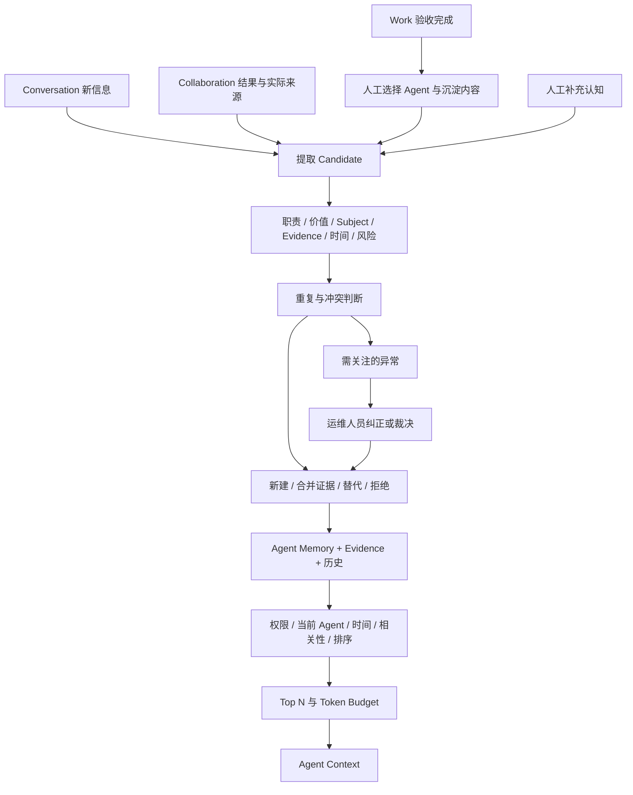

# Memory 2.0 数据库与领域模型变更方案

日期：2026-09-19。阶段：Phase 1 设计留档。状态：用户已明确评审通过并授权开发、迁移和在现有开发服务器部署。

本方案建立在 [Phase 0 代码审计](MEMORY_2_AUDIT_20260919.md) 和已确认纲要上。以下正文保留评审时的目标设计，不应把每项设计都视为已完成。实际实现、验证、发布记录和限制以 [2026-09-19 实施产品基线](PRODUCT_DESIGN_20260919.md) 为准。

最终口径：Agent 是唯一 Memory 所有者，历史有 Agent 的记忆同样共享；无 Agent 历史脏数据允许备份后删除；Work 必须人工沉淀；Meeting 不在本期新集成范围。

## 1. 已确认决定与方案默认值

### 1.1 已确认，不再重新讨论

| 决定 | 实施含义 |
| --- | --- |
| Memory 唯一 Owner 是 Agent | 每条长期记忆必须绑定一个 Agent；Workspace 仅承担隔离 |
| 对所有合法 Agent 使用者共享 | 创建用户不再限制 Runtime 召回；Subject 决定适用对象，不代表所有权 |
| 历史记忆也共享 | 有 agent_id 的历史数据保留，按新 Agent 授权规则使用 |
| 无 agent_id 的历史数据是脏数据 | 在经批准的迁移中备份后删除，不建设 Legacy 映射入口，不复制给所有 Agent |
| Work 必须人工沉淀 | 验收成功不自动创建 Memory；人选择目标 Agent 和内容后才进入治理 |
| 默认自动治理 | 普通 Candidate 不逐条待审批，人主要处理异常 |
| 不做 Personal / Shared / Workspace Memory 产品 | 不新增 Ownership 三分字段、共享晋升、共享审批或 Memory Sharing ACL |
| Meeting 不接入 | 不修改 Meeting ORM/API/UI/Prompt/流程，不创建专用适配层 |
| 不重做 Memory | 保留三分类、现有表和服务入口，增量替换治理及召回内部逻辑 |

### 1.2 本方案提出的实现规则，随本方案一起评审

- 认知管理和强制纠正复用 `agent.operate + agent.use + 具体 Agent Grant`；旧 memory.manage 单独持有者不能管理整个 Agent。
- Work 沉淀保留现有 Work 完成/验收身份、memory.manage 与目标 Agent 使用权组合，不额外要求 Work 沉淀者成为 Agent 运维人员。
- 普通用户说“这个记忆错了”产生纠错证据和治理判断，不授予强制覆盖权；运维人员通过正式纠错操作可以作出有审计的裁决。
- Candidate 与 Memory 共表；冲突、风险、待复核原因独立于 lifecycle，避免状态互相覆盖。
- 低可信且低风险的相关认知可以带不确定性召回；未通过高风险审查的认知默认不参与普通回答。
- 初期不建立可靠定时调度平台；实现有界、可重入的治理服务和人工调用入口，明确进程内触发的限制。
- 只保留未来扩展所需的 Source 类型，不为每个来源建设自动采集器。

## 2. 产品链路与职责



Work 沉淀和协作传播都不等于直接复制原始资料。Memory 正文是一条可独立理解、可治理的认知；Evidence 表达依据；Source 保持原始业务对象及自身权限。

## 3. 数据结构总体方案

### 3.1 当前结构与目标结构

当前：单表 t_memories，User 私有、agent_id 可空、单一 source、正文可覆盖，只有 active 检索与归档。

目标：扩展 t_memories，新增四张小型领域表：

| 表 | 作用 | 必要性 |
| --- | --- | --- |
| t_memories（扩展） | 当前认知、Candidate、归属、质量、时间、检索字段 | 复用已有正文、类型、状态、importance/confidence 等 |
| t_memory_evidences（新增） | 一条记忆的多份依据、Source 定位、证据独立性与失效情况 | 需要按 Source 反查、分别鉴权、并发追加、去重和删除传播 |
| t_memory_relations（新增） | supersedes / corrects / merged_into / conflicts_with / derived_from | 需要反向找到受影响认知，特别是跨 Agent 派生 |
| t_memory_events（新增） | 形成、合并、纠正、裁决、失效等变化记录 | 当前 updated_at 不能解释修改原因；历史不能依赖覆盖后的正文 |
| t_memory_issues（新增） | 异常的发现、处理、暂缓及关闭 | 生命周期无法表达“有效但有风险、同一冲突多次出现、异常已处理”等情形 |

不新增 Candidate 表、共享表、Memory ACL、专属向量库或通用后台任务表。Trace 复用现有运行记录的扩展载体，不把检索正文写入模型用量表。

### 3.2 为什么不把所有信息放进 metadata_json

| 内容 | 是否适合 metadata_json | 决定 |
| --- | --- | --- |
| Agent/Workspace、Kind/Subject、有效时间、风险、冲突、revision | 高频过滤、排序、约束及并发校验，JSON 不合适 | 独立列 |
| 多 Evidence / Relation | 需反查、独立删除和并发更新；数组重写容易丢更新 | 独立表 |
| 处理失败码、治理器版本、时间原文及精度、可信度解释 | 扩展属性，低频筛选 | 有版本的 metadata_json 结构 |
| Runtime Trace | 单次运行的有界结构，已有持久化宿主 | 复用消息/运行/协作扩展载体 |
| 原始聊天、交付文件、工具全量结果 | 有独立资源权限、大文本或文件生命周期 | 不复制进 Memory 元数据；引用原资源 |

保留现有 metadata_json 为 JSON，不为本期无差别改全站 JSONB。新增需要索引或结构查询的专属列/表使用 PostgreSQL JSONB。

## 4. t_memories 变更明细

当前字段完整列表见审计第 2 节。以下为目标差异。

### 4.1 保留与调整的字段

| 字段 | 目标与业务含义 | 兼容、约束 |
| --- | --- | --- |
| id | 原 UUID 主键不变 | 历史 ID 不改 |
| workspace_id | 原隔离字段保留 | 与 Agent.workspace_id 一致，不能由客户端跨空间指定 |
| agent_id | UUID，改为 NOT NULL | 迁移先清理 NULL；绑定后不能通过普通 PATCH 改 Owner |
| owner_user_id | 暂保留可空旧列，停止参与权限 | 仅保留历史所有者线索；新记录不写入；不当作 created_by 的可靠回填来源 |
| type | 原三分类不变 | API 继续使用 type，不强制全库改名 category |
| content | 原 Text | 新录入建议上限 2,000 字符；历史超长保留但按预算注入 |
| importance / confidence | 复用原数值 | 输入限定有限数值 [0,1]；计算方法、等级和依据另存解释 |
| status | 继续字符串状态 | candidate/active/superseded/expired/retracted/archived/rejected；应用层校验迁移、状态转换 |
| source_type / source_id | 保留作旧客户端摘要来源 | 新写入与首份 Evidence 在同一事务投影；所有治理以 Evidence 为准 |
| expires_at | 启用已有字段 | 策略过期，独立于事实 valid_to |
| created_at / updated_at | 保留 | created 不覆盖；治理变更统一更新 updated |
| access_count / last_accessed_at | 保留 | 采用原子增量，只统计实际注入，避免候选检索算使用 |
| embedding | 保留预留 | 不回填、不启用、不建立向量索引 |
| metadata_json | 保留 | 存 format_version、legacy 标记、治理依据、时间精度、root lineage 摘要等 |

`owner_user_id` 暂留是数据库回滚兼容措施，不保留 Personal Memory 产品语义。Memory 必须从通用 owner 钩子中单独排除并建立 Agent 过滤；其他私有对象保持原过滤。

### 4.2 新增字段

| 字段 | 建议类型、默认/空值 | 业务意义及新增理由 |
| --- | --- | --- |
| memory_kind | VARCHAR(32)，可空 | 比 type 精确；历史未知保持 NULL，不推测 |
| subject_type | VARCHAR(64)，可空 | user/distributor/region/work 等对象类型 |
| subject_id | VARCHAR(128)，可空 | 兼容 UUID、业务编码等正式标识；是多态业务定位，不伪装成统一 FK |
| subject_name | VARCHAR(255)，可空 | 名称回退与展示；同名不能直接认定同一实体 |
| claim_key | VARCHAR(255)，可空 | 归一化业务事项，如 region:east:responsible；辅助检测换负责人，不建设图谱 |
| source_mode | VARCHAR(32)，可空 | explicit/system/inferred；未知历史不填；表示认知形成方式，不随证据数量盲目变 system |
| created_by_type | VARCHAR(32)，可空 | human/agent/system；历史未知为 NULL |
| created_by_user_id | UUID，可空，FK 用户 | 触发/录入人，删除账号时可 SET NULL；不控制 Memory 所有权 |
| created_by_agent_id | UUID，可空，FK Agent | 自动形成认知的 Agent，可保留为来源身份；与 Owner 概念分离 |
| occurred_at | TIMESTAMPTZ，可空 | 事件发生时间，不复用保存时间 |
| valid_from / valid_to | TIMESTAMPTZ，可空 | 事实半开有效区间，结束必须晚于开始 |
| risk_level | VARCHAR(16)，默认 unknown | none/low/high/unknown；未知不等于高风险或已安全 |
| has_conflict | BOOLEAN，默认 false | 有未解决冲突的独立标记；与有效/历史状态可以并存 |
| revision | INTEGER，默认 1，正整数 | UI 并发裁决和后台决策提交时的版本核验 |
| normalized_hash | VARCHAR(64)，可空 | 按规范化正文计算的摘要，辅助精确重复候选查找；不做跨时间的唯一事实约束 |
| search_terms | JSONB，默认 [] | 有界分词及规范化短语数组，用 GIN 支持候选过滤，无需新扩展 |

现有字段不能表示多时间语义、Subject、冲突与形成方式，不能依靠 content 自然语言解析充当持久化模型。高频使用字段不只放 JSON。

### 4.3 类型、约束与引用一致性

- Kind 和 Source 类型通过应用注册表验证，避免 PostgreSQL Enum 导致每次扩展都迁移枚举。
- type/status 的合法集合在 Schema 和 Domain 校验；增加 importance/confidence 范围、revision 正数、有效区间的 CHECK，迁移前先检查历史异常值，不强行钳位伪造数据。
- 为 t_agents 增加 `(workspace_id, id)` 唯一约束；Memory 增加复合 FK `(workspace_id, agent_id)` 引用它，阻止跨空间绑定。该 Agent 约束是本方案唯一额外的现有业务表结构调整，不涉及 Meeting。
- Memory 增加 `(workspace_id, agent_id, id)` 与 `(workspace_id, id)` 唯一约束供子表/关系引用；与 UUID PK 功能部分重叠，但用于数据库层复合引用完整性。
- Evidence/Event/Issue 的 Memory 归属复合 FK 必须一致；不能只接受客户端传入的 workspace/agent。
- 旧 Agent 单列 FK 与复合 FK 的最终组合在迁移脚本里去重，不保留两套互相矛盾的删除规则。

## 5. Evidence：依据与访问分离

### 5.1 t_memory_evidences

| 字段组 | 建议字段/类型 | 意义 |
| --- | --- | --- |
| 主键及归属 | id UUID；workspace_id/agent_id/memory_id UUID 非空 | 归属目标 Memory，复合 FK |
| 来源定位 | source_type VARCHAR(64)；source_id VARCHAR(128) 可空；source_sub_type/source_sub_id 可空 | Conversation/Message、Work/Acceptance、DataQuery 等通用定位，外部非 UUID 也可扩展 |
| 来源身份 | source_user_id/source_agent_id UUID 可空 | 谁陈述/哪个 Agent 提供；身份是否可展示另行鉴权 |
| 证据类型 | source_mode VARCHAR(32) 可空；stance VARCHAR(16) | explicit/system/inferred；supports/contradicts/corrects |
| 证据解释 | summary TEXT 可空、限长；metadata_json JSONB | 简短依据与校验结果；summary 继承 Source 权限，不作为公共 Memory 文本 |
| 来源状态 | source_status VARCHAR(32)；recorded_at TIMESTAMPTZ | available/unavailable/deleted/unverified；保存依据的时间 |
| 来源版本 | source_revision VARCHAR(128) 可空 | 消息、交付物、知识版本或内容摘要，区分更新前后证据 |
| 幂等与独立性 | evidence_key VARCHAR(64) 非空；root_keys JSONB 默认 [] | 重复摄入去重；追溯同一事实的根来源，防止循环转述增强置信度 |

manual 也需要真实人工提交事件及操作者；没有上游 ID 时可用本次操作 UUID 作为定位，不能伪造 Conversation 或 Tool 来源。历史已记录的 source_type/id 可以迁入 unverified 引用，不能标成已检查或已支持事实。

一份 Source 可以形成多条 Memory；Evidence 是针对某条认知的依据，不要求为全库建立唯一 Source 主表。唯一约束 `(memory_id, evidence_key)` 防止重复插入；合并时核验 root_keys，独立证据数不等于行数。

### 5.2 API 展示规则

- Agent Memory 正文按用户已确认规则共享。
- Evidence 原始身份、来源标题、精确 ID、时间线摘要和链接，按 Source 访问权限逐项返回。
- 无 Source 权限：只返回允许显示的泛化类型、来源不可查看状态；不返回敏感摘要、原始 UUID 路径、用户名或附件名。
- 同一 Memory 详情可以有部分 Evidence 可查看、部分不可查看；统计只展示总量与可信度解释，不泄露受限来源详情。
- 运维权限不代替 Source 权限；系统内部治理读取已摄入依据和结构化来源状态，不以管理员身份绕过私有正文读取。
- Source Permission 的丧失不会自动撤销已形成 Agent Memory 的共享正文，符合用户的共享决定；Source 删除则遵循第 12 节传播规则。

## 6. Relation、Event 与异常事项

### 6.1 t_memory_relations

字段：id UUID、workspace_id UUID、from_memory_id/to_memory_id UUID、relation_type VARCHAR(32)、created_at TIMESTAMPTZ、created_by_user_id UUID 可空、metadata_json JSONB。

- `new → old: supersedes/corrects`；`duplicate → canonical: merged_into`；`derived → source: derived_from`。
- conflicts_with 对称，按 UUID 排序只存一对，避免 A→B 与 B→A 两条重复。
- 唯一 `(from_memory_id,to_memory_id,relation_type)`，禁止 self-link；两端通过 `(workspace_id,id)` FK 确保同空间。
- supersedes/corrects/merged_into/conflicts_with 默认同 Agent；本期仅 derived_from 可跨 Agent，通过实际 Collaboration 来源和授权校验创建。
- derived_from 只表示实质支持关系，不能把所有曾召回记录都关联到新认知。
- 创建派生关系检测循环，已有根来源集合去重；超过有界深度标记不完整且不增加 Confidence，不进行无限图遍历。

### 6.2 t_memory_events

字段：id、workspace_id、agent_id、memory_id、event_type、actor_type、actor_user_id、actor_agent_id、operation_id、idempotency_key、reason、before_revision、after_revision、data_json、created_at。UUID/整数/TIMESTAMPTZ 与现有风格一致，event_type VARCHAR(40)，reason 限长，data_json JSONB。

事件包括 created、candidate_rejected、evidence_added、merged、superseded、retracted、expired、archived、issue_opened/resolved、source_deleted、privacy_purged、policy_changed。

- Memory 变更、Evidence、Relation、Event 在同一事务提交；事件记录只保存必要差异、结果和 ID，不复制完整 Source。
- 事实正文变化原则上创建新 Memory；旧 Memory 正文保留。这样无需在每条事件中重复保存完整旧正文。
- JSON 中保存算法版本、参数版本、判定码和置信度变化理由，不保存模型完整思维过程。
- idempotency_key 可空；非空键按 Agent 唯一，用于治理提交/人工操作重试，碰撞时校验请求摘要，不能误返回不同请求结果。
- operation_id 是现有用量/请求的相关标识，不建立强制用量 FK，避免用量保留期限绑定领域历史。

### 6.3 t_memory_issues

字段：id、workspace_id、agent_id、memory_id、issue_type、severity、status、dedupe_key、related_memory_ids JSONB、reason_code、detail_json JSONB、created_at、updated_at、resolved_at、resolved_by_user_id、resolution_json JSONB。

issue_type 支持 conflict/high_risk/important_low_confidence/possibly_outdated/governance_failure；status 为 open/deferred/resolved/dismissed；severity 为 info/warning/critical。

- 每个 Agent 中相同 open/deferred dedupe_key 只保留一项，通过部分唯一索引防止异常队列膨胀。
- related_memory_ids 是当前异常的轻量集合；实际关系以 relations 为准，服务校验同 Agent，不通过 JSON 绕开授权。
- deferred 是暂缓处理，不代表确认事实正确；不能解除冲突/高风险阻断。
- “两者都不正确”可以只撤回、不创建替代；“记忆错了”但无正确内容时不得编造新 Memory。
- 普通低可信信息不全部进异常队列；只推送重要或高风险者，批量归并重复失败。

## 7. 权限与运行上下文

### 7.1 权限矩阵（拟采用）

| 操作 | 必须满足 |
| --- | --- |
| Runtime 使用 Memory | 有效成员、当前 Workspace、agent.use、目标 Agent 授权且可用；无创建人过滤 |
| 普通对话提供信息/纠错反馈 | 上述运行权限；经 Candidate 治理，不具备直接裁决权 |
| 记忆列表/详情/统计/调试管理 | agent.operate + 目标 Agent 合法使用权 |
| 手工新建、强制纠错、替代、归档、解决异常、修改规则 | 同上；服务再检查具体 Memory 归属、revision、请求内容 |
| Work 人工沉淀 | 原 Work 权限与 completed 条件 + memory.manage + 目标 Agent 合法使用权 |
| 原始 Evidence Source 访问 | 独立执行 Conversation/Work/Document/Data 等原权限 |
| 永久删除 | workspace.manage + Agent 治理权限；隐私请求按 Source 删除规则；记录最小审计 |

memory.manage 暂保留兼容 Work 人工沉淀资格，目录文案改为“提交记忆沉淀”；不再用作通用 CRUD 放行条件。本期不增加逐 Memory ACL 或共享权限角色。

停用 Agent 不参与 Runtime。治理 UI 本期沿用现有 Agent 运维可用性门槛；停用期间的清理由有权管理者执行明确维护路径，不能为了访问历史临时放宽所有运行权限。删除 Agent 优先要求先处理所属 Memory，见第 12 节。

### 7.2 服务与 ORM 防线

- 新增明确 MemoryContext，至少包含 actor、workspace_id、agent_id、purpose、operation_id、权限快照版本；purpose 为 runtime/governance/source_cleanup 等受控服务用途，不接受客户端任意切换。
- 从 PRIVATE 排除 Memory，同时改 owner before_flush 特例；Memory 及子表增加 Agent 和 Workspace 读写约束，通用 API/Agent API/后台入口都调用同一策略。
- 普通 Runtime 只能查询 context.agent_id，不因用户有多个 Agent 授权就联合检索它们。
- other_agent_memory 的证据查看单独检查源 Agent 授权；不开放跨 Agent Memory 批量搜索 API。
- SSE 与进程内任务使用独立 session，恢复并重新校验当前身份；权限撤销后终止后续召回/写入，不使用过期 Actor 快照完成治理。
- 无 Actor 不默认为管理员。Consolidation 必须由有权操作者发起，绑定具体 Agent；未来系统任务身份另行设计。
- Source 清理服务只能按删除请求识别确切派生记录并清理，不向请求者返回其无权查看的其他 Agent/来源正文。

## 8. Candidate 与自动治理规则

### 8.1 治理步骤

1. 接收已授权来源、目标 Agent 和稳定摄入键；记录来源实际版本。
2. 识别独立认知、Subject、Kind、时间和 Agent 职责适配；排除临时信息、凭证及不适合长期共享的内容。
3. 持久化 candidate 与可核验来源定位。Agent 自己的无依据回答不能变成 explicit/system 证据。
4. 按 Workspace + Agent + Subject/claim_key + 相似文本筛选有界候选。
5. 精确重复用规则判断；语义近似用一次有界模型判断辅助，不让模型授权访问或选择任意数据库记录。
6. 校验模型给出的 action、引用 ID、时间与理由；不合法/超时/无法判断则保留 candidate，生成可合并的失败或冲突事项。
7. 锁定、核验 revision 与来源仍存在；事务提交 create/merge/supersede/reject，连同 Event 和 Evidence。

Agent 的职责来自现有 responsibilities/boundaries 等字段，不新建职责产品。职责为空时仅依据明确任务与来源判断，不自行编造职责；治理规则记录该限制。

### 8.2 自动操作边界

| 输入情况 | 默认结果 |
| --- | --- |
| 清楚的低风险长期事实，来源有效，无冲突 | 自动 active；Confidence 根据依据计算 |
| 用户明确“记住”且可保存 | 快速路径，仍过权限、职责、重复与冲突 |
| 无证据推测/寒暄/一次性问题 | rejected，保存短原因，不复制无用原文 |
| 同 Agent、同 Subject/事项、语义等价且时间兼容 | 合并证据，重复 Candidate archived，记录 merged_into |
| 有结构化变更依据或明确新有效时间，且不是未解决的高风险冲突 | 自动新建并结束旧事实有效区间，记录 supersedes |
| 两个高可信来源在同一时间范围矛盾 | 不覆盖；has_conflict=true，建立冲突和异常事项 |
| 普通用户否定现有高可信事实 | 加纠错/反对 Evidence，走冲突规则；不是直接 retract 的授权 |
| 有权限运维人员通过纠错操作说明原因 | 原错事实 retracted；新内容经范围/重复校验形成 active 或与现有 Canonical 关联 |
| 高风险且未通过监督裁决 | 保留 candidate 或阻断普通召回；异常页面处理 |

合并只在当前 Agent 内执行。跨 Agent 相同内容也保留各自认知；跨 Agent 的矛盾通过收到的 Collaboration 信息形成当前 Agent 的不确定性，不修改对方。

### 8.3 Confidence 与风险

- 复用 [0,1] 数值，UI 初始等级建议低 <0.5、中 0.5–<0.8、高 ≥0.8；阈值置于版本化规则，可调，不表示统计概率。
- explicit 证明“有人明确说过”；system 证明“该系统事件/结果确实返回”；inferred 证明“这是推断”。它们不自动保证业务结论正确。
- 规则结合根来源独立性、支持/反对一致性、源可用性、人工纠正、验证事件与时间新鲜度。重复点击、转述和重复查询相同快照不增加独立支持数。
- DataQuery 单次样本不能推导“通常如此”；工具成功也不能把模型扩写当系统事实。Memory 可为 inferred，同时拥有 system Evidence。
- 历史数值保留，但标注 legacy_uncalibrated；在重新治理前不显示为“已验证高可信”，排序使用保守置信度因子。
- 简单风险规则包括指定 Agent/Kind/业务主题、Importance 和检测标记，不建设通用 Policy Engine；保留判定原因和规则版本。
- 成为 Agent Memory 后按已确认规则共享。不引入用户级 Memory ACL；不适合共享的原始敏感信息在提取阶段拒绝或进入受控复核，不以隐藏字段方式暗中形成 Personal Memory。

### 8.4 并发与幂等

- 提取摄入键由 Agent、Source、Source revision 和提取规则版本构成；同一版本重试不反复建候选。
- 模型请求在事务外进行，不持有数据库锁等 LLM。
- 提交治理时按 Agent 获取短事务级 advisory lock，避免同一 Agent 同时首次创建等价 Canonical；现有 Memory 另锁行并核验 revision。
- 发现匹配集合改变则有限重试；超限记录候选与治理失败，不按过期判断静默覆盖。
- Work 保留父记录锁和重复点击兼容，同时增加请求幂等键；不把永久重复正文唯一化，因为不同时期可能发生同类事件。
- Evidence 唯一键、Relation 唯一键和 Event 操作幂等作为最后防线。source deletion 与写入使用稳定来源锁顺序/提交前复核，避免删除后再写入派生内容。

## 9. Temporal 与状态转换

### 9.1 时间口径

统一存 TIMESTAMPTZ；界面按 Asia/Shanghai 展示。事实有效期采用 `[valid_from, valid_to)` 半开区间：用户输入“有效至 8 月 31 日”时结束存为 9 月 1 日零点，并保存原始日期精度。不能把不确定月份强行变成精确事件时刻。

日期缺失保留 NULL；“9 月 1 日”缺年份且上下文无法证明时标记待澄清/未知，不自动按当前年份覆盖旧事实。created_at 绝不批量复制为 valid_from/occurred_at。

### 9.2 生命周期规则

| 状态/标记 | 当前查询 | 历史查询 |
| --- | --- | --- |
| candidate / rejected | 不注入 | 不当事实使用 |
| active | 有效期覆盖当前且未策略过期才可用 | 时间匹配时可用 |
| superseded | 不作为现行事实 | 有已知匹配有效期时可用 |
| expired | 默认排除 | 只有已知事实有效期可证明时作为历史资料，注明曾过期 |
| retracted | 不当事实使用 | 仅治理/审计可见，不作为曾经正确的事实 |
| archived | 默认排除 | 正常历史检索也排除，管理查询可见 |
| has_conflict | 不作为确定事实；相关时提供冲突包 | 按目标时间评估是否仍冲突 |
| high risk 未解决 | 默认阻断普通注入 | 同样阻断，不通过历史查询绕过 |

未来生效替代：先保留新旧记录，分别设置不重叠有效期和 supersedes 关系；旧记录在新时间到来前仍有效。查询依据时间即时判断，不依赖后台任务准时把旧记录状态改为 superseded。可调用 Consolidation 再物化状态变化。

自然语言时间解析产生 as_of 或 time_range。问题是“去年”而那一年有多人任职时，返回分段有效事实，不武断选择某一天或最近一条。无法识别时保守按当前查询并记录解析限制。

## 10. Retrieval、排序、预算与 Trace

### 10.1 复用与有界候选

保持 retrieve_memories / memory_reference 等统一入口，内部增加结构化 RuntimeContext 和 RetrievalResult；调用方最终只从 result 注入，避免各自重新拼装权限或评分。

1. 先限定 Workspace 和当前 Agent，检查权限；不检索其他用户/空间/Agent 的候选再做后置隐藏。
2. 从问题和任务上下文构造目标 Subject、意图、时间；当前用户的表达偏好通过明确 Subject 处理，不当成所有用户通用偏好。
3. SQL 中按状态、时间、search_terms/Subject/claim_key 取候选，默认候选上限 200。对较旧有效事实、事件、Focus 保留不同通道配额，不能只按 updated_at 取最近 200 条。
4. 对有限候选计算相关性；query/content 都做统一规范化。已知对象名称、业务词、受控同义词可以扩展；姓名相同不当成同一 ID。
5. 相关性低于阈值直接排除；达到门槛才考虑 confidence、importance、时间衰减与 Focus。
6. 发现入选项有冲突，补取同一冲突中当前用户可用的相关对方，组合成不可被 Top N 拆散的冲突包；预算不够时整体降级为不确定性提示，不只保留一方。
7. 选择 Top N 并裁剪到 Token Budget，记录 selected 与 injected 差别；不在每轮调用 LLM 检查全库冲突。

复用 jieba 分词；search_terms JSONB GIN 的词集合过滤不需要新向量基础设施。中文切词和同义词存在局限，跨措辞零词重合的召回不保证；用评测题库量化，不声称已经具备完整语义检索。写入去重可对有界相似候选调用模型辅助。

### 10.2 初始排序配置（建议默认，需测试校准）

各分量归一到 [0,1]。相关性最低门槛建议 0.2；无有效 query 词、Subject 或任务语义信号时返回空，不由 importance 补位。

| 类别 | 排序倾向 |
| --- | --- |
| semantic | relevance 0.60、confidence 0.25、subject match 0.10、importance 0.05；时间有效性先硬过滤 |
| episodic | relevance 0.60、confidence 0.15、occurred_at recency 0.15、importance 0.10；历史查询相对目标时间计算 |
| focus | relevance 0.60、subject/intent match 0.20、confidence 0.10、importance 0.10；相关 Focus 可再加最多 0.1 的 boost |

缺失分量不伪造：例如 occurred_at 未知不当作“刚发生”，在 Trace 标识 unknown，权重按可用项规范化；不能因缺失自动增加可信度。冲突和未验证风险决定是否注入及展示方式，不单靠扣几分掩盖冲突。

默认 Top N=5、Memory Budget=1,200 tokens、上限 10 条/2,400 tokens；默认每次治理相似候选不超过 20 条、每个来源提取不超过 5 条。参数集中在 Agent.memory_config 的版本化结构，超出平台上限拒绝，不散落硬编码。

估算 Token 有供应商 tokenizer 时使用它，否则保守估算并预留余量；记录 estimator，不把字符数当精确 Token。Top N/预算/候选上限与分数均写入 Trace。

### 10.3 Prompt

继续用平台 reference_message 的非指令参考数据格式。分为 Stable Memory、Relevant Past Events、Current Focus、Uncertain / Conflicting Memory。

每项包含允许共享的 Memory ID、正文、Subject、可信等级、事实时间和不确定性标记，不夹带无权查看的 Evidence 摘要。Focus 文案明确“只影响相关场景关注权重，不代表监控或提醒”。

平台原有来源限制优先，例如用户要求只用公开网络资料时，Memory 不绕过本轮检索策略。记忆正文即使包含“忽略规则”也只是数据。

### 10.4 Trace 存储与访问

- 统一结构记录 operation_id、runtime/source ID、Agent、query 摘要或哈希、解析的 Subject/时间、候选计数、过滤原因、各评分、rank、selected/injected、预算、耗时、算法版本。
- 详细候选最多记录 50 条，其余保存按过滤原因聚合计数；不记录未授权范围内的 ID 或正文。
- 对话使用现有 ConversationMessage.metadata_json 的受控 trace 段；协作采用现有 result_sources 的保留命名空间并更新序列化契约；有 AgentRun 的入口使用 output_data 的平台元数据段。不是所有 Runtime 当前都有 AgentRun，不能强造记录。
- 普通对话响应仅返回安全的记忆使用说明；详细治理调试另经 agent.operate 鉴权，同时保持宿主 Conversation/Run 的原权限，不让运维人员借 Trace 读取他人私聊。
- Memory 运维可查看不含原始 query 的 Agent 级统计；本期不建设跨用户全量 Runtime 查询后台。
- 默认保存 Memory ID、revision 和评分，不重复保存 Memory/Evidence 正文；现有旧 debug_trace 正文副本在删除传播中必须清理。
- usage 继续记录模型调用量和动作来源，只用 operation_id 关联，不把 Memory 内容塞进 UsageCall.usage_detail。

## 11. 业务集成与可靠性边界

### 11.1 Conversation

- LLM 对话完成后，从已落库的用户消息、真实工具结果、明确引用的资料提取；助手文本仅提供语境，其推断保持 inferred。
- 对同步、流式和重新生成使用同一幂等提取入口；重新生成不重复计算原用户消息为新 Evidence。
- 在原消息 metadata_json 记录本次提取 pending/success/failed 和版本。进程内执行使用独立 session；用户结束流不能造成已登记工作的状态假完成。
- 模型响应不等待深度整理。Candidate 已持久化后可在异常页/服务中重试；消息提交后、任务尚未运行时重启可能需要人工恢复，不宣称 exactly-once 可靠队列。
- Proxy 不默认向外部接口发送 Memory 或私有历史。本期不改外部协议；本地明确用户陈述可通过同一治理入口形成记忆，Proxy 输出缺乏结构化依据时不自动认定事实。没有受控本地模型配置时显示提取跳过，不能假定 agent.model 对 Proxy 一定可用。

### 11.2 Collaboration

- 调用目标 Agent 只召回目标自己的 Memory；必须保留当前用户对目标的授权及 Workspace。
- 目标回答携带实际采用且可传递的 Memory 引用，验证引用来自本次可用集合；没有可证明引用时只记录 collaboration 来源，不能伪造 M102 等关系。
- 接收 Agent 根据职责形成自己的 Candidate，保留 source_agent、collaboration 和派生 relation；不复制全部目标 Memory。
- 同一根来源经多 Agent 转述只算一份根证据，禁止循环传递提高 Confidence。
- 目标记忆撤回或删除，接收端标记派生依据失效并重新治理，见第 12 节。

### 11.3 Work

- approve、completed 事件不直接调用 Memory 写入；不因扫描 Work 而绕开人工沉淀。
- 人在 WorkMemories 选择 Agent、内容和类型；可预填验收 Outcome，但必须提交才写入。
- 沉淀请求同时携带/选择最终交付物和验收活动引用；服务确认它们属于当前 Work 且可访问。
- “Work 已验收通过”可为 system + outcome；从交付物提炼的一般事实按证据判断 explicit/inferred，不能一律 confidence=0.9。
- 保留重复点击幂等。返回 created/merged/candidate/rejected 等真实结果，UI 不将待治理或合并误报为新建成功。
- WorkActivity 保存操作和 Memory 引用，尽量不新增完整 Memory 正文副本；历史副本纳入清理。

### 11.4 Consolidation

以当前 Agent 为单位分批运行 duplicate/evidence/conflict/confidence/supersede/expire/archive；记录游标、处理量、失败和规则版本。配置建议单批 100 条，超时返回可继续的游标。

只有服务调用和明确人工触发，不绑定 Focus，不开定时检查。过期和未来生效的正确性由实时 Retrieval 判断保障，不能等待后台巡检。异常检测不是对外提醒产品。

## 12. 删除、撤权与派生传播

| 事件 | 拟定传播规则 |
| --- | --- |
| 删除 Conversation/Message | 当前入口实际删除资源，因此清除对应 Evidence 原文摘要与受限定位展示；唯一依据消失时 Memory archived 并清除其可恢复正文，只留无正文删除标记；有其他独立依据则重新评估，仅保留剩余依据足以支持的认知 |
| 历史 Memory 仅定位到 Conversation | 会话删除可精确处理；单消息删除无法辨别时保守将该会话旧来源依据标为需复核并阻断单源召回，不伪造精确映射 |
| 重生成助手消息 | 推断仅依赖旧回答时失效；明确用户陈述或独立工具证据仍在则保留，不重复增加 Evidence |
| 明确隐私永久删除 | 清除目标来源正文、Evidence 摘要、仅由它派生的 Memory/事件内容及旧 Trace/WorkActivity 副本；保留不含正文的删除审计；沿派生关系有界处理 |
| 多独立依据保留 | 不自动把删除来源的敏感细节带入重述；无法证明剩余支持时先阻断再复核 |
| 原 Memory 被纠错/撤回 | dependent Evidence 标为不可用，派生 Memory 同步标记治理未完成并阻断确定事实注入；批量重新治理，不能等以后偶然召回才发现 |
| 原 Memory 正常 supersede | 派生历史事件可保留；现行认知复核时间有效性，不把所有历史结论一起判错 |
| Work 取消 | 表达业务状态变化，不执行隐私删除；既有事件仍是历史事实 |
| User 停用/移出空间 | 立即失去使用权限；其已摄入 Agent 认知继续按 Agent 共享，停用不等于信息失真 |
| Agent 停用 | 不可运行；Memory 保留在该 Agent，不置空、不转给其他 Agent |
| Agent 物理删除 | 建议 FK RESTRICT，先执行明确 Memory 清理并处理他 Agent 派生关系；严禁 ORM 自动 SET NULL；普通删除遇到记忆时返回明确阻断原因 |
| Workspace 删除 | 按现有明确删除操作清理该空间 Memory 及子表；不得移出空间；先清理新领域引用再完成原删除路径 |

权限撤销与来源删除不同：一位用户看不到 Source 不意味着所有 Agent 认知必须失效；用户已批准 Agent 内共享。永久删除也无法撤销人已读过的回答；本期可清理的是系统控制下的存储副本与后续召回。独立人工撰写、无派生标记的业务资料不能被系统猜测后连带删除。

来源删除不等于事实被证伪，因此不滥用 retracted。无正文删除标记以 archived + metadata_json.content_purged 表达，content 只保留固定的删除说明，不能从历史接口恢复原文；这是明确数据删除的例外，不是普通编辑。彻底物理删除时先处理反向派生及子表，再删除主记录，最终审计只保留删除动作、计数和不含正文的标识。

删除锁定确切 Source 与受影响关系，先在事务中阻断后续召回，长链清理分批继续；不能先显示永久删除成功再允许 Memory 继续使用。遇到未完成传播返回处理中/失败并可恢复，不建设通用 Worker。

## 13. 索引与容量设计

建议索引需在隔离库数据集上用 EXPLAIN 验证；这里不声称实库已经存在或性能达标。

| 表/索引 | 用途 |
| --- | --- |
| memories(workspace_id,agent_id,status,updated_at DESC,id) | Agent 管理分页、常用状态 |
| memories(workspace_id,agent_id,subject_type,subject_id) | 正式 Subject 精确过滤 |
| memories(workspace_id,agent_id,claim_key) 非空部分索引 | 同一事项变化/冲突匹配 |
| memories(workspace_id,agent_id,normalized_hash) 非空部分索引 | 精确重复候选 |
| memories(workspace_id,agent_id,valid_from)、同域 valid_to/occurred_at 按查询计划选择 | 当前/历史有效性、事件区间；不承诺一个 B-tree 能同时优化所有区间条件 |
| memories(expires_at) WHERE status='active' AND expires_at IS NOT NULL | 批量策略过期 |
| memories(search_terms) GIN | DB 关键词候选；与 Agent B-tree 结合，禁止先全局输出再过滤 |
| evidences(memory_id,evidence_key) UNIQUE | 追加幂等 |
| evidences(workspace_id,source_type,source_id,source_sub_id) | Source 删除反查 |
| relations(from_memory_id,to_memory_id,relation_type) UNIQUE；to_memory_id 索引 | 演化关系与反向派生传播 |
| events(agent_id,created_at,id)、events(memory_id,created_at,id) | 周统计、详情时间线 |
| events(agent_id,idempotency_key) 非空 UNIQUE | 操作重试 |
| issues(agent_id,status,severity,updated_at,id)；open/deferred 去重键 UNIQUE | 需要关注列表、重复问题归并 |

Category/Kind 不先机械各建一列索引；根据 Agent/状态前导索引和实际选择性再评估，避免写入开销无界增加。原 owner_user_id 索引暂留以方便回滚，待后续基线收口再移除。

初始评测集建议 1,000/10,000/100,000 条 Memory，跨多个 Agent/Workspace，并包含“较旧但正确”、高重要性无关、近期重复、日期冲突和多用户偏好。

建议验收预算：10,000 条/Agent、并发 5 的无 LLM Retrieval P95 ≤300ms；100,000 条规模应有界返回/明确降级，候选数与注入预算不增长到全量。该值是待验证目标，不是已测承诺；记录实际硬件、缓存冷热、DB 耗时和准确率，再调整策略。检索不增加模型调用，写入模型消耗归因 memory_extract/memory_governance，超额留待重试。

## 14. API 设计

复用 `/api/memories` 和现有 Agent 运维/Work 路径，不新建 `/api/v2`。以下均为拟新增/调整契约。

| 接口 | 行为 |
| --- | --- |
| GET /api/memories | 必须指定 agent_id；搜索、category/type、kind、Subject、status、confidence、risk/conflict、时间筛选；默认 limit=30，最大100，稳定游标分页 |
| POST /api/memories | 必须 agent_id；有治理权限的人工新建，仍经 Candidate；兼容原 type/content，增加 Subject/时间/依据 |
| GET /api/memories/{id} | 详情、可用操作、revision、简要依据，按当前 Agent 授权 |
| PATCH /api/memories/{id} | 仅允许非事实元数据修改并记录历史；content、事实时间、Subject 实质变化返回需用纠错/替代动作，不能静默覆盖 |
| DELETE /api/memories/{id} | 保持归档语义；UI 名称明确，不伪装永久删除 |
| GET /api/memories/{id}/evidences、/history | 独立分页，来源逐项鉴权 |
| POST /api/memories/{id}/corrections | reason、可空 new_content、expected_revision、证据、幂等键；无新内容只撤回 |
| POST /api/memories/{id}/supersessions | new_content、事实有效时间、reason、expected_revision；现实变化使用 |
| POST /api/memories/{id}/restore | 已归档恢复时重新校验依据和有效期，不直接硬设 active |
| POST /api/memories/{id}/purge | 明确永久删除，按独立删除权限执行传播与副本清理；不复用普通 DELETE 归档语义 |
| Agent 运维 memories 子路径 | 保留为同一 Service 适配入口，不复制治理实现 |
| GET /api/agent-operations/{agent_id}/memory-summary | 有效数量、近期 create/merge/supersede、异常数量；从现有记录真实聚合 |
| GET /api/agent-operations/{agent_id}/memory-issues | 需要关注列表 |
| POST /api/agent-operations/{agent_id}/memory-issues/{id}/resolve | A/B/时间不同/均不正确/暂缓；核验关联记录 revision |
| POST /api/agent-operations/{agent_id}/memory-consolidation | 有界整理一次，返回处理量/游标/失败，不承诺定时任务 |
| PATCH /api/agent-operations/{agent_id}/memory-config | 受限配置字段，阈值与预算范围校验、版本和审计 |
| POST /api/works/{id}/memory | 保留人工入口，增加 Evidence 引用与治理结果；不得从 approve 自动调用 |

兼容说明：原字段名和路由优先保留，但“省略 Agent 查询全部私有记忆”“直接覆盖正文”和“普通成员按 memory.manage 操作全量记忆”是有意终止的旧行为。新 UI 同步切换，错误码/提示明确；不能用兼容名义保留绕过新权限的后门。

分页响应建议 `{items,next_cursor,has_more}`，属于已知响应形状变化；AgentResources/运维适配同步更新，旧内部调用全部盘点。POST 返回 outcome、memory_id/canonical_memory_id、status、issue_id（仅有权时）、existing；HTTP 状态区分已完成与待治理，UI 显示实际结果。

现有 Agent 运维 summary 中的完整 memories 数组同步移除或改为有界首页摘要，列表走分页接口；否则即使新列表分页，旧资源汇总仍会全量加载。已清除正文的删除标记不能通过 restore 恢复；需要真实独立依据时重新创建认知。

## 15. UI 方案

入口维持 Agent 运维资源导航中的“记忆”，适配用户已调整的布局，不新增一级导航或空间记忆 Tab。Agent 配置页原记忆入口复用同一组件与新权限，不留下旧私有 CRUD。

### 15.1 页面结构

```text
当前 Agent 的资源导航 → 记忆

有效认知 | 本周新增 | 自动合并 | 自动更新 | 需要关注

[需要关注] [全部记忆]                         [+ 补充认知]

搜索…  分类  状态                  高级筛选

认知内容 / 关于 / 类型 / 可信度 / 时间 / 冲突或风险标记
分页与加载状态

详情抽屉或现有详情区域
  当前认知 → 关于与时间 → 为什么记得 → 认知变化 → 操作
```

不展示“今天待确认全部 Memory”。统计的“有效认知”使用与 Runtime 一致的时间/状态口径；未来生效、候选、阻断认知单独区分。周统计按上海时区，从 Event 聚合，无法计算的项不显示伪造数字。

### 15.2 主要交互

- 补充认知：正文、类型、Subject、依据；可选时间，高级信息折叠。
- 纠正：当前内容、正确内容（可暂不提供）、原因、依据；明确是错误纠正还是事实发生变化。
- 冲突：双方认知及允许查看的 Evidence 并列，提供确认 A/B、时间不同、均不正确、暂缓。
- 详情：展示 superseded/retracted 等真实状态，点击相关 Memory 前重新鉴权；不以“编辑正文”隐藏历史。
- 来源不可访问：泛化说明，无原文摘要、私人名字和隐含标题。
- Work：维持人工选择 Agent，保存后区分新建、合并证据、待处理、拒绝，不能一律“已保存新记忆”。
- 列表加载与错误保留筛选/输入；权限失效清除旧详情；窄屏、浅深色、键盘、焦点和主题均遵循 UI 规范。

## 16. 迁移、回填、部署与回滚

### 16.1 迁移前检查（本轮未执行）

确认实库字段/索引/约束与 ORM 差异，统计总数、NULL Agent、无效 Agent、跨空间绑定、owner/source 空值、超长正文、非法状态、非有限质量值和重复来源。只输出计数及问题 ID，不打印私人正文或凭证。

用户已授权“无 Agent 开发脏数据可删除”；该授权不自动覆盖其他异常行。发现非空但失联/跨空间 Agent 等额外异常时列清单阻断迁移，不按猜测修复或扩大删除范围。

### 16.2 执行顺序（确认方案后才编写并执行）

1. 在独立可丢弃 PostgreSQL 库演练 up/down、幂等和失败回滚。
2. 备份 t_memories、相关 Agent 约束、角色权限目录及受影响元数据，保存删除行快照与哈希清单；备份限制访问，不提交仓库。
3. 暂停写入或短时停服务，确保旧代码不能继续产生 NULL Agent/私人写入；不做新旧写入服务混跑。
4. 加可空/有默认值的新列及四张表；核验现有列类型，不依靠 create_all 自动修改旧表。
5. 保存并删除 agent_id=NULL 的脏数据；其他历史 Memory 的 ID、content、type、importance/confidence、时间和状态原样保留。
6. 仅回填可证明信息：确定性 search_terms/hash、revision；已有 source_type/id 可形成 unverified legacy Evidence；NULL Kind、Subject、来源模式、实际创建者与时间保持未知。
7. 为历史行标记 legacy_import、confidence_uncalibrated；不根据 created_at 推断事实有效期，也不将 owner 当成陈述者。无有效来源仍可兼容使用但标注来源未知、不得宣称经验证。
8. 建唯一/检查/复合 FK/查询索引，完成 agent_id NOT NULL；删除行为改 RESTRICT 并配套 ORM 关系处理。
9. 更新权限路径和应用代码，启动前验证 schema 版本，测试 Agent 内跨用户共享、跨 Agent/Workspace 拒绝及 Source 隐藏。
10. 发布新前端及服务，校验运行状态和相关页面；只在后续开发验收通过后按项目既有部署授权执行。

新增迁移采用项目已有 `scripts/migrate_*.py` 风格，但要求显式目标、预检/dry-run、逐步版本、成功标志和失败退出。本轮不创建可执行迁移脚本，不运行任何启动隐式建表路径。

### 16.3 风险与回滚

| 风险 | 应对 |
| --- | --- |
| 私有改 Agent 共享 | 用户已明确授权；只能移除 Memory 私有边界，Source 私有边界保留，针对双用户做回归 |
| 无 Agent 数据删除 | 执行前单独备份行与相关活动引用；数量核对，回滚可恢复原 ID |
| 加约束/索引锁表 | 开发库停写窗口内执行，先测规模；大表需要拆分索引步骤时说明非事务边界 |
| 老服务继续写旧语义 | 不滚动混跑；schema 兼容检查与停写切换 |
| 模型误判、循环证据增强 | 规则校验、根证据去重、版本核验、冲突阻断和可追溯事件 |
| 新后端配旧前端 | 列表形状/纠错动作一起发布；旧正文 PATCH 明确拒绝 |
| 回退后重新泄露/错误归属 | 禁止把新增 Agent Memory 随意分配给某个 User 以迁就旧权限 |

回滚步骤：停写 → 备份升级后增量 → 回退应用/构建 → 按迁移快照恢复旧表、原 owner/nullable 约束、已删除脏数据、权限目录及必要元数据 → 校验旧私有模型 → 启动。新建四表可先保留离线，确认无引用后再按逆序移除。

升级后形成的 Agent Memory 没有可靠旧用户 Owner，不能无损翻译回 1.x。回滚时导出并隔离这些增量，不放入旧 Runtime；这是明确的产品语义回滚限制，不能声称仅 down DDL 就无损。历史共享已被人读到的内容也无法通过回滚“收回”。

## 17. 拟修改文件与模块分工

以下只是开发清单，不表示本轮已修改。

| 模块/文件 | 修改目的 |
| --- | --- |
| db/models.py | Memory 字段/Agent 复合约束/删除关系；不改 Meeting 模型 |
| memory/models.py（拟新增） | 四张领域表，按项目模块化模型方式注册 |
| memory/schemas.py、policy.py、governance.py、evidence.py、lifecycle.py（拟新增） | 共享校验、治理、来源规则、时间与状态；避免 API 各写一套 |
| memory/service.py | 保留入口，接入自动治理和有界 Retrieval |
| memory/retrieval.py、trace.py（视实现拆分） | 排序、预算、结构化结果与安全追踪 |
| security/isolation.py、access.py、http.py、catalog.py | Memory Agent 权限、owner 特例、运维/普通使用区别 |
| api/memories.py、api/agent_operations.py | 列表/详情/治理动作/配置；替换旧正文覆盖路径 |
| api/conversations.py、agents/context.py | 统一召回、提取幂等、来源定位、Source 删除及 Trace |
| collaboration/manager.py 及 schemas | 目标 Memory、实际采用来源与派生认知 |
| api/works.py、work/service.py、work/schemas.py | 保留人工沉淀，补证据及返回结果、正文副本清理 |
| api/agents.py、api/workspaces.py | 新 FK 下的明确删除流程，不改变无关业务状态机 |
| frontend/src/components/AgentResources.vue、WorkMemories.vue | 入口适配、共享语义、人工沉淀结果 |
| MemoryList/Detail/Evidence/Issues/Correction 组件（拟新增） | Agent 运维治理界面，共享组件与主题 |
| frontend/src/api/index.js、ConversationDebugPanel.vue | API 契约与安全 Trace 展示 |
| scripts/migrate_memory_2.py（批准后新增） | 显式迁移、回填、验证与回滚入口 |
| tests 与 frontend/tests | 业务规则、数据库权限/迁移、并发、UI、回归 |

不全库格式化，不整目录覆盖服务器独有修改，不因该方案重做知识库、工作流或 Meeting。

## 18. 验收矩阵

所有条目均待实施后执行。本轮只检查方案一致性和文档链接。

| 编号 | 场景 | 预期 |
| --- | --- | --- |
| M01 | 三类旧记忆 | 类型与内容可用，缺失新字段不报错，不伪造来源时间 |
| M02 | 同 Agent 的 A/B 用户 | 合法使用者都可利用记忆，原创建者不限制 |
| M03 | 无 Agent 授权/跨空间 | Runtime、列表、详情、关系、Evidence、Trace 均不能越权 |
| M04 | 管理权限区别 | 普通成员可提供信息；无 agent.operate 不可枚举/强制纠错整个 Agent |
| M05 | 用户作为 Subject | 李四的报告使用李四偏好；询问张三偏好时不误做当前用户偏好 |
| M06 | Explicit | “报告先给结论”形成 semantic/preference，来源为实际用户消息 |
| M07 | 低价值/无依据回答 | 拒绝或保持未验证候选，不变系统事实 |
| M08 | 多次同义表达 | 一条 Canonical + 独立 Evidence，无限重复被抑制 |
| M09 | 并发与重复请求 | 两次同时首次写入仍只产生一个 Canonical，无 Evidence/Relation 重复 |
| M10 | 跨 Agent 转述回环 | 不自动复制、不提高同根证据独立数、不产生无限派生循环 |
| M11 | Supersede 与未来任职 | 当前、去年、未来查询均按事实区间，未来生效不提前替代 |
| M12 | “去年”区间多人任职 | 返回各阶段，不只取最新；未知时间明确标识 |
| M13 | Correction | 原认知 retracted、新认知可追溯；只否定无新内容不编造替代 |
| M14 | True Conflict | 不静默覆盖；Top N/预算不能只注入一方造成假确定 |
| M15 | Evidence Permission | 能用共享正文也打不开私聊，无权限响应不泄露来源摘要/身份 |
| M16 | 删除与写入竞态 | 删除后不得重建来源派生内容；多证据保留要有独立支持 |
| M17 | 派生来源撤回 | 下游立即停止确定性使用，再有界重评；无历史回填伪证据 |
| M18 | Work approve | 记忆数量不变，未人工沉淀不产生 Memory |
| M19 | Work 手工沉淀 | 校验目标 Agent/Work 权限，关联验收/交付，重复提交返回真实结果 |
| M20 | 高 importance 无关内容 | 不过相关性门槛，不入选 |
| M21 | Focus | 仅相关 Boost，没有后台任务/提醒/Work 副作用 |
| M22 | Trace | 有候选/过滤/评分/预算解释，限量且无原始私有证据泄露 |
| M23 | 大规模与历史召回 | 内存候选有界、Top N/Token 有界，旧但有效的重要事实不被近期噪声挤掉 |
| M24 | 中途撤权/重启失败 | 停止无权写入，失败可见/可重试，不冒充可靠队列 |
| M25 | 迁移/up/down | NULL Agent 删除可恢复，其余字段不伪造，重复运行安全，失败不半迁移 |
| M26 | Meeting 回归 | 原模型/API/Prompt/UI不变；共用隔离修改不破坏其私有权限 |
| M27 | UI | 浅/深/跟随系统，键盘、窄屏、分页、错误和权限失效处理 |
| M28 | Agent/Workspace 删除 | 不出现 NULL Owner 记忆、不把记忆转移到其他 Agent/空间 |

单元测试验证时间、状态、排名和规则；隔离 PostgreSQL 测试验证权限、事务、唯一约束、并发及迁移；前端测试验证真实业务状态；构建与必要浏览器回归后才部署。不得把 mock 通过当成实库隔离或发布验收。

## 19. 限制、后续阶段与批准边界

本期可交付：Agent 所有权、多证据与演化历史、自动治理、异常处理、时间检索、相关排序、详情与纠错、Conversation/Collaboration 集成、Work 人工沉淀、删除传播和可调试能力。

部分能力的边界：关键词检索不是完整语义检索；Confidence 是可解释等级，不是统计真值；进程内执行没有持久化调度保证；不同来源无可靠 ID 时不能保证自动实体对齐；历史来源缺失不追溯编造；没有依据标记的任意历史回答无法保证自动识别全部派生片段。

明确未实现且不在本期：Personal/Workspace/Shared Memory、共享晋升、Memory Sharing ACL、Meeting Memory Integration、完整 Experience、Graph/GraphRAG、向量基础设施、Agent 自动 Work Executor、Human Harness/Sensor/Robot、Monitor/Reminder/Scheduled Task、统一 Worker。

后续开发顺序：领域与迁移 → 治理及权限 → Retrieval → Conversation/Collaboration/Work → 治理 UI → 完整测试与发布 → 更新产品基线，分别记录已实现、部分实现和限制。

本方案需要确认的整体变更范围是：扩展 t_memories、增加四张 Memory 领域表及相关索引/约束、增加 Agent 复合唯一约束、按已确定规则迁移历史和清理 NULL Agent 数据、调整 Memory 权限与 API 行为。确认该方案后再开展 Phase 2；本轮无上述结构或数据改动。
