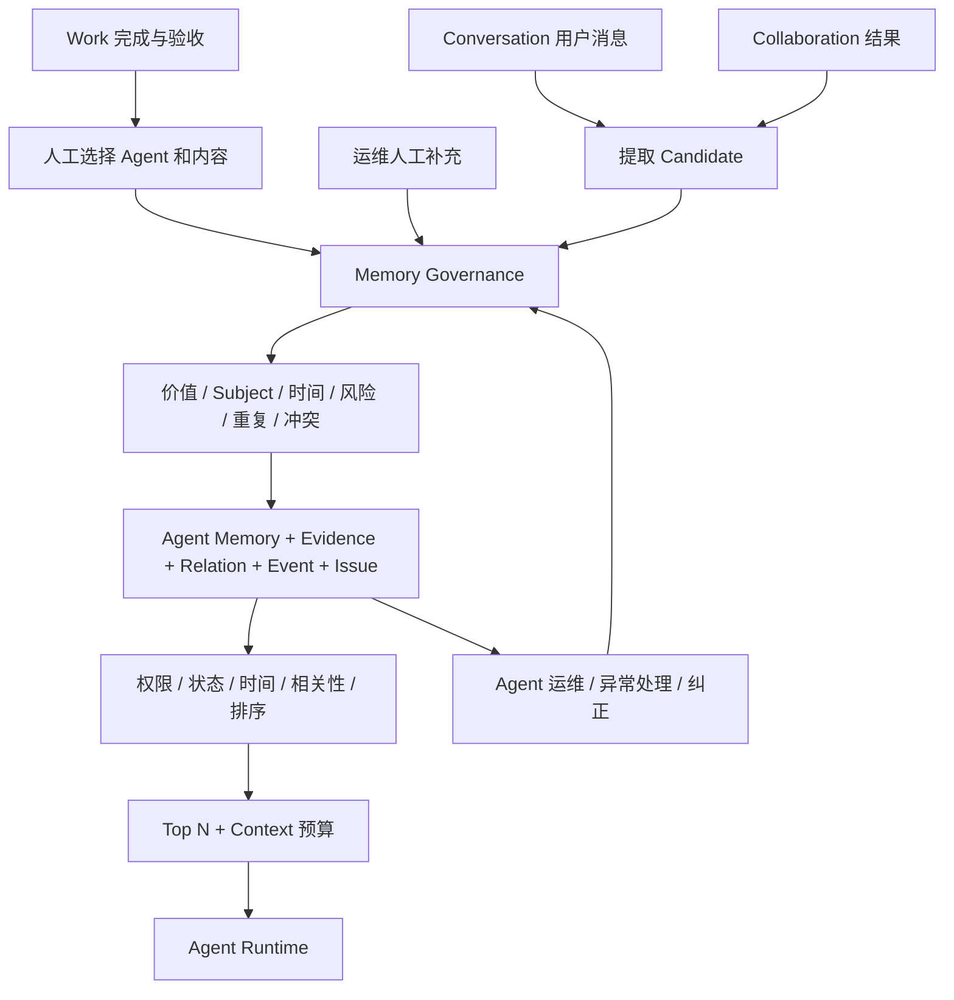

# AgentDevStu 产品设计与 Memory 2.0 实施基线

版本：2026-09-19。适用环境：现有开发服务器 47.97.82.200。

本文描述本期实际产品行为、领域设计和工程边界。平台整体定位、知识库、数据能力、真人 Work、组织与账号等既有模块延续 [2026-09-18 产品基线](PRODUCT_DESIGN_20260918.md)；本文替代其中的 Memory 所有权、检索、治理和相关 UI 描述。原 [审计](MEMORY_2_AUDIT_20260919.md) 是升级前快照，[数据库与领域提案](MEMORY_2_DESIGN_PROPOSAL_20260919.md) 是已批准的设计留档，不能替代实际实施记录。

## 1. 产品定位与最终决定

AgentDevStu 继续定位为企业 Agent 协作与真人工作闭环平台。Memory 2.0 是 Agent 长期认知层：把运行中形成的认知、依据、有效时间和变化历史连起来，在有权限且相关的场景中少量召回。

| 最终决定 | 当前产品行为 |
| --- | --- |
| Agent 是唯一记忆所有者 | 每条 Memory 必须有 agent_id，Workspace 提供隔离边界 |
| 共享给所有合法 Agent 使用者 | 用户有当前空间及具体 Agent 使用授权，Runtime 才能使用该 Agent 的记忆 |
| 历史有 Agent 的记忆也共享 | 不按历史 owner_user_id 限制召回；该字段仅保留来源兼容意义 |
| 用户不是 Memory Owner | 用户可以是创建者、来源人或 Subject；个人偏好按 Subject 适用性筛选 |
| 无 Agent 的历史记录可删除 | 迁移先备份，再删除 agent_id 为空的脏数据；不构造虚假归属 |
| Work 必须人工沉淀 | 验收本身不创建 Memory，人选择 Agent 和正文并提交 |
| 普通认知自动治理 | 人主要处理冲突、高风险、低可信和治理失败等异常 |
| 认知与原始来源分开授权 | 共享认知不授予私人 Conversation、Work 或交付物的访问权 |

本期不实现 Personal / Agent Shared / Workspace Shared 三种所有权产品，不提供共享晋升流程。**Meeting 与 Memory 的新集成不属于本期开发范围。**没有修改 Meeting ORM、API、UI、Prompt 或状态机。

## 2. 用户角色与典型旅程

### 2.1 使用者

用户选择有权使用的 Agent，发送业务问题。系统在该 Workspace、该 Agent 范围内筛选相关认知，检查状态、时间、风险、Subject 和冲突，按数量及预算加入 Context。其他用户的偏好不直接当作当前用户偏好；明确查询该对象时可以相关召回。

对话后提取任务使用独立数据库 session。只从用户消息提取长期认知，不把 Agent 自己的回答直接证明成事实。新认知进入 Candidate 治理，重复内容补充依据，冲突保留双方，需要处理的事项进入 Agent 运维。

### 2.2 运维人员

进入「Agent 运维 → 记忆」，查看有效认知、本周新增/合并/更新和需要关注事项。可切换异常事项与认知列表，搜索、查看详情与依据、纠正、记录事实变化、归档、恢复，并分批执行整理。管理要求 agent.operate 与具体 Agent 使用授权同时成立。

### 2.3 Work 成果沉淀者

已有 Work 完成/验收及成果权限继续生效。用户选择目标 Agent，填写精炼认知，可关联交付物，确认提交。界面提供「填写验收结果」快捷模板，仍须人工保存。只有系统可证明的精确验收模板被识别为 system Outcome；任意填写的结论属于 explicit，不因 Work 已通过就自动变成系统确定事实。

## 3. 架构与责任边界

继续复用 t_memories、/api/memories、Memory service、Conversation 与 Collaboration 的原有 Context 接口。领域模块拆出 access、evidence、governance、integration、lifecycle、policy、retrieval、schemas 和 models，避免各入口独立实现权限与治理。

Knowledge 是人工维护的资料，Memory 是运行形成的认知；高置信 Memory 不自动转为 Knowledge。Experience 是下次如何行动的方法体系，本期仅为其保留 Outcome、Evidence 和 Correction 数据。Focus 只影响相关召回，不创建 Monitor、Reminder、Automation 或 Work。

## 4. 数据模型

### 4.1 保留的主表

t_memories 保留 id、workspace_id、agent_id、type、content、importance、confidence、status、source_type/source_id、metadata_json、embedding、expires_at、created_at/updated_at、access_count/last_accessed_at，以及兼容字段 owner_user_id。原 source 字段作为兼容首要引用，多依据以 Evidence 为准。embedding 仍为预留，未启用向量基础设施。

| 新增字段 | 类型/语义 |
| --- | --- |
| memory_kind | 可空字符串；更细业务语义 |
| subject_type / subject_id / subject_name | 可空；对象类型、正式 ID 或名称 fallback |
| claim_key | 可空；用于同一业务命题的候选匹配，不是知识图谱 |
| source_mode | explicit / system / inferred；历史未知允许空 |
| created_by_type / created_by_user_id / created_by_agent_id | 创建来源角色与主体，不参与所有权判断 |
| occurred_at | 事件发生时间，可空、带时区 |
| valid_from / valid_to | 事实有效区间，可空、带时区 |
| risk_level | unknown / none / low / high |
| has_conflict | 与生命周期分离的冲突标志 |
| revision | 正整数；重要更新、纠正和并发版本核验 |
| normalized_hash | 正文规范化散列，用于确定性重复检查 |
| search_terms | JSONB 词项，配合 GIN 索引筛选候选 |

agent_id 改为非空；(workspace_id, agent_id) 复合外键指向 t_agents，防止错配空间；有记忆时 Agent 删除受到 RESTRICT 保护。新增范围唯一约束服务于子表外键。confidence/importance 必须在 0—1，revision 大于 0，有效时间结束必须晚于开始。

### 4.2 四个治理表

| 表 | 业务职责 | 关键字段与约束 |
| --- | --- | --- |
| t_memory_evidences | 为什么记得，一条 Memory 多个依据 | memory_id、source_type/id/sub_type/sub_id、source_user/agent、source_mode、stance、summary、source_status/revision、root_keys；memory+evidence_key 唯一 |
| t_memory_relations | 替代、纠正、合并、冲突与派生 | from/to_memory_id、relation_type、创建者、metadata；关系唯一、禁止自环、空间复合外键 |
| t_memory_events | 认知治理审计 | event_type、actor、operation/idempotency_key、reason、before/after_revision、data_json；Agent 内非空幂等键唯一 |
| t_memory_issues | 需要人关注的异常 | issue_type、severity、status、related_memory_ids、reason_code、detail、resolution、处理人/时间；未关闭问题去重 |

Evidence、Event、Issue 均有 Workspace/Agent/Memory 复合外键。Relation 允许同一空间内跨 Agent 的 derived_from，其他治理关系禁止跨 Agent；派生链检查循环和深度，深度超过 16 拒绝新增。

### 4.3 metadata 与专用列的选择

状态、对象、时间、风险、冲突、检索词等需要稳定查询、索引、约束，因此采用列。低频扩展保留在 metadata_json，例如 legacy_uncalibrated、source_review_required、content_purged、risk_approved 和 confidence_basis。多依据、多关系和审计不能仅靠一个随正文覆盖的 JSON 表达，所以拆表。

### 4.4 索引

主表包含 workspace+agent+status+updated_at+id、subject、claim_key、normalized_hash、valid_from、valid_to、occurred_at、expires_at 和 search_terms GIN。子表覆盖来源反查、关系目标、事件时间、异常队列与幂等去重。没有新增向量库或通用任务表。

## 5. Category、Kind 与时间

Category 继续为 semantic（事实、关系、偏好）、episodic（事件、观察、成果）、focus（未来相关场景的关注）。Kind 为 fact、preference、relationship、decision、event、observation、outcome、concern、other。数据库使用字符串，当前 API 对这九项校验；未来扩展需同步验证和 UI 映射。

created_at 是保存时间；occurred_at 是发生时间；valid_from/to 是事实成立时间；expires_at 是系统策略到期时间。有效区间采用 **[valid_from, valid_to)**，结束时刻不包含在内。接口要求带时区；UI 本地时间转换为 ISO 时间。

例如张三有效到 9 月 1 日 00:00，李四从同一时刻生效。历史查询允许旧 superseded 记忆在对应区间出现；当前查询仅使用当前有效 active。未知时间不从 created_at 猜测。自然语言时间解析目前支持明确日期、明确年份、今年和去年，并不覆盖任意时间表达。

## 6. 生命周期、治理与纠错

### 6.1 生命周期

| 状态 | 含义 | 默认当前召回 |
| --- | --- | --- |
| candidate | 尚未完成治理或等待核验 | 否 |
| active | 当前认知 | 通过其他过滤后可以 |
| superseded | 曾经正确，后来被替代 | 否；历史时间查询可用 |
| expired | 有效期或策略到期 | 否；明确历史查询按时间判断 |
| retracted | 已确认错误 | 否 |
| archived | 保留历史但退出日常使用 | 否 |
| rejected | 不应进入长期记忆 | 否 |

conflict 不增加为互斥 lifecycle，而以 has_conflict+Issue 表达，避免覆盖 active/superseded 语义。

### 6.2 Candidate 到认知

写入先检查身份、Agent、Source、长度、类别、对象、职责匹配、长期价值和敏感/高风险信号。确定性规范化重复优先处理；同 Agent、同类且兼容 Subject 的候选再判断重复、补充、时间更新、冲突或独立认知。存在相似候选时可用 Agent 模型做有界判断，最多提供 20 条、调用超时 15 秒。失败不伪装成成功，保留待治理对象与异常。

普通推断不会作为 system 来源。敏感密钥等内容会被拦截，高风险认知需要核验后才能正常使用。当前规则与模型检查并非完备敏感数据分类器。

### 6.3 Duplicate、Merge 与 Confidence

治理边界始终为同 Workspace、同 Agent。重复优先保留 Canonical，追加去重 Evidence，并记录 merged_into 和审计。Evidence 的 root_keys 用于识别派生自同一根来源的重复佐证，避免 Agent 相互引用无限抬高置信度。置信度结合来源方式、有效依据、人工确认与冲突调整，UI 用高/中/低表达。

精确重复、少量规范化同义和有界模型判断已经实现，但不承诺任意中文同义句总能合并。没有启用 Embedding。

### 6.4 Supersede 与 Correction

明确同一命题的新有效时间可以形成 supersedes，结束旧有效期并保留旧正文。正式纠正要求原因、expected_revision 和幂等键；旧认知 retracted，新认知及纠正依据、关系和事件一起保存。重复请求返回既有结果，同键不同输入返回 409。

正文事实不能通过 PATCH 悄悄覆盖。普通属性调整与纠正分开；事实变化使用「事实发生变化」。纠正同时关闭受影响旧冲突，并更新相关对象状态，其他无关冲突继续保留。自然语言中的“这个记忆错了”尚不保证自动定位到正式 Correction；可靠入口为 UI/API。

### 6.5 True Conflict 与异常处理

无法证明时间替代或纠错关系时保留双方，不让模型静默裁决。运维可确认一方、两者分时有效、两者均错误或暂不处理。提交时校验权限及修订版本，结果写事件和处理记录。冲突召回以完整未解决关系组为单位：若数量或预算无法容纳完整组，整组不注入，避免仅呈现一方。

### 6.6 Consolidation

提供同 Agent、可分页、可重入的整理 Service/API，处理重复、置信度、冲突、过期与待核验。单批最多 100 条，循环约 20 秒后返回续页游标；正在执行的模型调用仍可能占用额外超时窗口。没有新建可靠定时调度、Worker 或后台任务平台。

## 7. Retrieval 与 Context

先校验实时 Actor 和具体 Agent，再在数据库限制 Workspace、Agent、可用状态、时间、风险和来源复核状态。关键词使用 jieba、有限规范化同义词和中文双字词项，JSONB/GIN 查询词项交集；不是 BM25，也不是向量搜索。每种 Category 分配有界候选通道，避免单类占满。

相关性必须先达到阈值，Importance 不能让完全不相关对象越过门槛。用户偏好检查 Subject；未知时间不伪造历史事实；待治理、撤回、归档、来源待复核和正文已清除对象不参与日常召回。

| 类别 | 当前排序公式 |
| --- | --- |
| semantic | 0.60 相关性 + 0.25 置信度 + 0.10 Subject + 0.05 Importance |
| episodic | 0.60 相关性 + 0.15 置信度 + 0.15 事件新近程度 + 0.10 Importance |
| focus | 0.60 相关性 + 0.20 Subject + 0.10 置信度 + 0.10 Importance + 有界 Focus Boost |

这是当前工程策略，不代表离线评测得出的最优权重。有效性和权限作为过滤门槛。历史未校准记忆排序使用的置信度上限为 0.5，但不覆盖原存储数值。

| Agent 配置 | 默认 | 范围 |
| --- | --- | --- |
| top_k | 5 | 1—10 |
| token_budget | 1200 | 200—2400 |
| candidate_limit | 200 | 20—500，总候选按三类分配 |
| relevance_threshold | 0.20 | 0.05—0.90 |
| focus_boost | 0.10 | 0—0.10 |
| semantic_judgment | true | 是否启用写入语义判断 |
| extract_limit | 5 | 1—5 |

预算使用保守字符估算，不是模型精确 tokenizer。Context 分为稳定认知、相关历史事件、当前关注、不确定或冲突认知；inferred、低可信和冲突明确提示不得视为确定事实。Focus 文案明确不代表监控或提醒。

## 8. Source、Evidence 与删除传播

Evidence 支持结构化来源、子来源、修订、来源人/Agent、摘要、可用状态和根依据。当前闭环重点为 Conversation/message、Collaboration、Work、deliverable、activity/human feedback、manual、other_agent_memory。其他类型属于扩展空间，不等于已经有自动采集适配器。

Evidence 返回前单独鉴权。无权访问时不返回原来源正文、标识或私人摘要，展示来源不可访问；历史迁移引用标为 unverified，不伪造已验证依据。Source revision 用于拒绝从已编辑消息的旧快照继续提取。

| 变化 | 当前处理 |
| --- | --- |
| 私人 Conversation/消息删除或替换 | 校验原 Source 权限并锁定来源；移除对应依据私人内容，传播依赖 |
| 已无可用支持依据 | 清除认知正文和检索词，归档并保留无正文 tombstone |
| 仍有其他依据 | 降低可信度，标记 source_review_required，暂停普通召回并进入复核 |
| 上游认知纠正或撤回 | 沿 derived_from 标记下游依据不可用，要求重新核验 |
| 隐私正文永久清除 | 要求额外 workspace.manage；处理派生对象与已知 Trace/Work 活动副本 |
| Agent 删除 | 有记忆时阻止直接删除，避免级联丢失；应保留或停用 Agent |
| Workspace 删除 | 有治理记忆时保护性阻止相关删除流程 |

清除保留关系完整性的 tombstone，不是删除整个数据库记录。已知结构化 Trace 和 Work 活动副本会清理；不能自动识别所有历史自由文本回答中可能已转述的内容，也不能擦除外部导出、模型供应商记录或备份。用户停用、Agent 授权撤销通过现有身份/使用鉴权阻断后续访问，不宣称本期实现了全域隐私删除系统。

## 9. Conversation、Collaboration 与 Work 集成

Conversation 提取任务在响应链之外运行，登记消息 metadata 中 pending/success/failed 状态，使用独立 session；模型返回后重新检查会话身份、角色/授权及 Source 修订，分条提交以缩短事务锁。进程内防重复任务，应用退出时取消任务。失败支持 message memory-retry API。进程重启不自动恢复全部 pending，这不是持久队列。

Collaboration 继续让目标 Agent 使用自己的 Memory Retrieval 2.0。协作成功后可以为发起/接收结果的 Agent 蒸馏长期认知，并验证真正使用的上游 Memory、根依据及派生关系；不机械复制目标 Agent 全部记忆。两个 Agent 都必须有实际授权，跨 Agent 派生不突破 Workspace。

Work 继续复用完成人工验收后的沉淀入口、权限和活动记录。请求内容去重，用户可附交付物 Evidence。验收活动是确定 Outcome 的依据；正文模板为“工作「标题」已验收通过。”。自定义业务结论不会因来自已验收 Work 就获得 system 置信语义。当前 Work 沉淀保留行锁，写入模型判断可能延长同一 Work 并发操作等待，最长受模型超时限制；这不是批量吞吐优化实现。

## 10. UI 设计与操作

2026-09-20 交互增量：用户界面统一称“记忆”；详情、补充、纠正/事实变化及召回规则改为弹窗，分类/状态等选择改用 SearchSelect。召回规则各输入项右侧有帮助图标，支持悬浮和键盘查看说明；独立草稿确保取消不会改变已保存规则。该增量不调整数据库或治理语义。

该增量已构建并部署到现有开发服务器，服务及前端资源健康检查通过。使用模拟 API 的浏览器交互检查覆盖 1440px 浅色、1440px 深色和 390px 跟随系统：弹窗边界、帮助提示、取消不保存、保存成功/失败、纠正切换、Escape、关闭焦点/滚动恢复、分类/状态筛选和标签切换后下拉隐藏均通过；检查不向真实业务数据提交记忆。发布备份位于 `/opt/agentdevstu/backups/memory-ui-20260920`。

保持现有全站侧栏、账号底部和应用框架边距；保留用户已调整的 Agent 运维布局。记忆治理放在 Agent 运维现有记忆入口，没有新增个人记忆或空间记忆一级产品。

AgentMemory 共用服务能力，包含统计区、需要关注列表、认知列表、搜索和分类/状态常用筛选；Kind、Subject、Confidence 等高级筛选折叠。认知详情展示正文、类型、可信程度、来源方式、Subject、适用时间、Evidence、变化历史和关联记忆。历史按 created_at/id 倒序游标翻页。

纠正/事实变化表单与新建分开，版本冲突需要刷新处理。永久清除有明确确认；来源链接仅在可访问时提供。Work 活动显示沉淀结果和 Memory 标识，避免复制私人正文。Conversation 调试面板增加可读召回摘要和候选信息，同时保留原始 Trace 查看。

## 11. API 合同

| 接口 | 用途 |
| --- | --- |
| GET /api/memories | Agent 范围列表、筛选、游标 |
| POST /api/memories | 人工补充，进入统一治理 |
| GET /api/memories/{id} | 认知详情、权限、可见关系 |
| PATCH /api/memories/{id} | 合法属性调整；事实正文走正式纠正 |
| DELETE /api/memories/{id} | 归档，兼容入口但不物理删除 |
| POST /api/memories/{id}/restore | 恢复可恢复的归档记录 |
| POST /api/memories/{id}/purge | 永久清除正文及关联私人数据，保留 tombstone |
| POST /api/memories/{id}/corrections | 纠正事实 |
| POST /api/memories/{id}/supersessions | 事实变化与替代 |
| GET /api/memories/{id}/evidences | 逐条来源鉴权的 Evidence |
| GET /api/memories/{id}/history | 认知事件历史 |
| GET /api/agent-operations/{id}/memory-summary | 治理概览 |
| GET /api/agent-operations/{id}/memory-issues | 待处理异常 |
| POST /api/agent-operations/{id}/memory-issues/{issue_id}/resolve | 人工裁决/重试 |
| POST /api/agent-operations/{id}/memory-consolidation | 分批整理 |
| GET/PATCH /api/agent-operations/{id}/memory-config | Agent 召回规则 |
| POST /api/works/{id}/memory | 人工 Work 沉淀 |
| POST /api/conversations/{id}/messages/{message_id}/memory-retry | 对话提取重试 |

沿用现有认证和权限中间件，无独立 /api/v2。列表和管理要求 Agent 运维权限；Runtime 内部召回要求实际 Agent 使用权，二者不能混同。409 表示并发修订/幂等冲突，422 表示输入或时间不合法，越权仍由统一体系返回 403/404。

## 12. 可观测性与性能边界

Trace 记录策略版本、Agent/Workspace、查询散列与词数、时间范围、候选、过滤原因、relevance、confidence、importance、focus boost、score、rank、selected/injected、数量预算和耗时；不存新的原始查询正文副本。接入现有 Conversation debug 与模型用量上下文。

Trace 候选明细有截断（最多 50 条）；数据库已经排除的每个对象不会逐条出现。injected 表示进入选定 Context，不证明模型最终使用或依赖了该事实。没有建设所有 Agent 使用统计仪表盘。

实时 Retrieval 不调用 LLM 对全库做判断。复杂语义治理主要在写入和整理阶段；索引前置过滤、分类型有界候选、Top N 与预算限制避免全量注入。已有千条无关高 Importance 数据测试，不等于完成十万级容量或线上 P95 性能基准。

## 13. 迁移、历史兼容与回滚

scripts/migrate_memory_2.py 默认只读 preflight；必须显式 --apply 和私有 --backup 才执行。迁移在事务中运行，数据库 advisory lock 避免重复并行，锁等待上限 10 秒。应用启动不自动触发该迁移。

步骤：停止应用写入 → 私有备份原 Memory 结构/约束/索引/行 → 新增 17 列 → 清理无 Agent 数据 → 约束和四张治理表 → 索引 → 回填规范化 hash/search_terms、legacy 标记及真实已有 source 引用。已有 source 引用写入 unverified Evidence。不会猜测 kind、confidence、source_mode、valid_from 或 occurred_at。

保留 semantic/episodic/focus、历史正文及现有 Confidence 数值。owner_user_id 不再承担 Memory 隔离；这是用户明确批准的共享语义改变。旧 API 入口保留，但删除变归档、正文修改走纠正、管理权限变为 Agent 运维属于主动合同收紧，外部旧客户端需适配。

回滚先停止服务，使用原快照 --rollback --backup <原备份> --export <升级后私有导出>，导出升级后状态，再重建原 t_memories 结构与行；随后恢复部署前代码和 dist 并启动。回滚不使用 CASCADE，遇意外外部依赖应失败停止。升级后的新认知只保存在回滚导出中，不会自动合回旧模式。

## 14. 验证与发布记录

2026-09-19 已在现有开发服务器完成本次 Memory 2.0 迁移与部署。

| 项目 | 实际结果 |
| --- | --- |
| 全量自动回归 | 331 passed、1 skipped，耗时 277.80 秒；10 个既有 FastAPI on_event 弃用警告 |
| 跳过项 | 用量 PostgreSQL 独立集成测试未配置 USAGE_TEST_DATABASE_URL；不把它计为通过 |
| 前端构建 | Vite 构建通过；已有主包大于 500 KB 的提示 |
| 静态检查 | Memory 模块、API、迁移及专项测试的 Ruff F 检查通过，git diff --check 通过 |
| Memory 数据 | 迁移前 115 条，迁移后保留 115 条；无 Agent 脏数据 0 条，无数据删除 |
| 历史依据 | 根据既有 source 引用建立 110 条 unverified Evidence；其余不伪造来源 |
| 结构 | 新增 17 列、四张治理表及相应约束和索引 |
| 服务 | agentdevstu.service 为 active |
| 页面与资源 | 首页、Agent 运维、Work SPA 入口及引用 JS/CSS 返回 200；公网首页返回 200 |
| 未登录防护 | /api/memories 与 Agent 治理概览接口返回 401 |
| 浏览器验收 | 内置浏览器连接两次超时，未完成登录后的视觉/点击验收；HTTP 200 不等于视觉验收 |

所有 PostgreSQL 回归用随机隔离 schema 在现有开发数据库演练，不运行 public schema 清库测试。迁移测试验证应用、重复应用、私有备份权限和回滚恢复，并已纳入全量回归。

服务器备份目录：/opt/agentdevstu/backups/memory2-20260919。code-before.tar.gz 保存部署前相关代码和完整 dist，memory-before.json 保存原 Memory 数据/结构，migration-result.json 保存迁移结果，new-files.json 用于回滚识别新增文件。备份目录限制访问，数据备份文件权限 0600，未提交到 Git。

发布只覆盖本次变更的后端与前端源文件，并发布本地构建产物。服务器现存 usage/api.py、usage/context.py 与本地基线存在调用名称差异，本轮保留服务器文件，未顺带覆盖；这意味着服务器并非完整 Git 工作树镜像。前端使用本地最新基线构建，包含此前已存在的布局与控件改进。

验证覆盖：分类兼容、Agent 共享与 Source 私有分离、Agent/Workspace 隔离、管理越权、重复/并发幂等、纠正与冲突清理、历史/当前时间、过期、来源删除传播、来源修订拒绝、Work 人工沉淀、千条无关数据不进入 Prompt、迁移幂等和回滚。部分测试使用可控模型返回验证领域逻辑，不是实际供应商模型质量评测。

## 15. 已知限制与下一阶段

1. 自动提取和整理没有可靠持久调度；重启留下的任务需重试。
2. Keyword 与有限模型治理不是完整语义检索；任意同义、时间推理、实体消歧需题库评测。
3. 自然语言纠正不保证目标定位，正式 UI/API 才是稳定路径。
4. 旧 Source 引用无法验证时保持 unknown/unverified，不批量编造依据。
5. 来源删除传播覆盖已知结构化依赖，不承诺清除所有自由文本、外部导出或历史备份。
6. 未建设完整敏感数据识别、独立合规删除系统或分布式并发调度。
7. Memory tombstone 仍阻止 Agent 直接删除；需保留或停用，未来可单独设计退役流程。
8. 未完成大规模容量、P95 和真实模型长期准确率评测；应围绕具体业务建立测试题库。
9. Observation 与更多 Source 扩展仅有表达空间；没有 Sensor、Robot、Human Harness 实际接入。
10. 没有 Experience、Knowledge Graph、GraphRAG、新向量基础设施、Monitor、Reminder、Scheduled Work 或 Agent 自动 Work Executor。
11. Meeting 保持原有产品与代码，本期无新 Memory 接入。

下一阶段建议先用真实业务校准重复/冲突与相关性阈值，补持久任务恢复和权限撤销运行验收，再按独立需求评估其他来源。以正确、当前、相关、可追溯、可纠正、隔离和效率衡量结果，不以累计 Memory 数量衡量成长。

## 16. 本期文件与代码入口

| 范围 | 主要文件 | 作用 |
| --- | --- | --- |
| 主表与迁移 | src/agentdevstu/db/models.py；scripts/migrate_memory_2.py | 增量字段、约束、显式迁移和回滚 |
| Memory Domain | src/agentdevstu/memory/models.py、schemas.py、policy.py、access.py | 治理记录、输入验证、确定性策略和授权 |
| Memory Governance | src/agentdevstu/memory/governance.py、evidence.py、lifecycle.py | 候选、合并、冲突、纠正、证据、传播与整理 |
| Retrieval/Integration | src/agentdevstu/memory/retrieval.py、integration.py、service.py | 有界召回、Context、异步提取及原接口兼容 |
| API | src/agentdevstu/api/memories.py、agent_operations.py、conversations.py、works.py | 治理、运维、来源变化与人工沉淀 |
| 删除保护与隔离 | src/agentdevstu/api/agents.py、workspaces.py；security/catalog.py、http.py、isolation.py | Agent/Workspace 保护，路由权限和共享边界 |
| Runtime | src/agentdevstu/collaboration/manager.py；web/app.py；work/schemas.py | 协作来源、任务退出与沉淀输入 |
| UI | frontend/src/components/AgentMemory.vue、AgentResources.vue、ConversationDebugPanel.vue、WorkMemories.vue | 治理页面、详情、Trace 和 Work 操作 |
| 页面与请求 | frontend/src/views/AgentOperations.vue、Works.vue；frontend/src/api/index.js | 保留布局、绑定治理组件及 API |
| 测试 | tests/test_memory2.py、test_memory2_migration.py，以及 agent_operations、conversation_commit、identity_security、memory_types、work 测试 | 新领域回归与旧合同适配 |
| 文档和忽略规则 | README.md、本文、审计和提案；.gitignore | 实施基线、设计留档，排除用量运行数据 |
