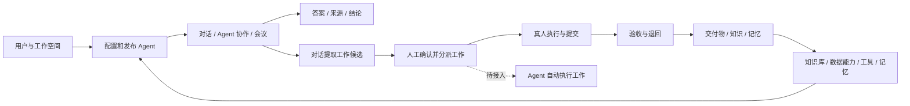
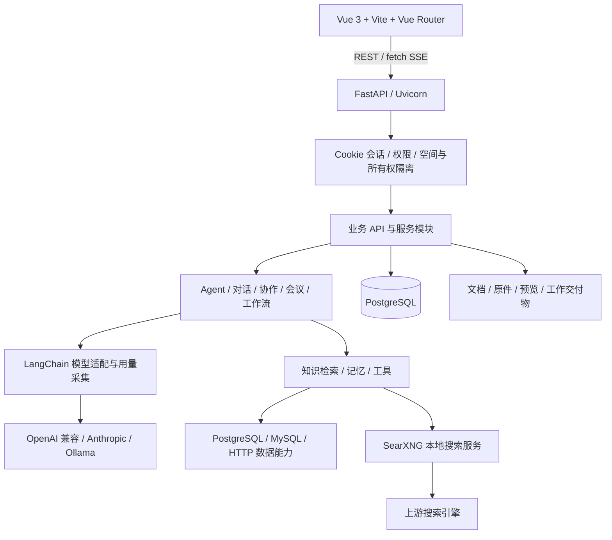

# AgentDevStu 项目需求、系统架构与 UI 开发基线

整理日期：2026-09-16。用途：下一期需求拆分、技术设计、开发交接与验收。

本文基于当前本地工作区代码、历史基线和 UI 规范整理，不代表新版本发布，也不代表本次重新完成线上验收。原版本标识仍为 `alpha v1.0.2609050000`。当前工作区包含大量未提交及未跟踪的实现，不能只用 Git HEAD 代表完整功能状态。

事实口径：文中的“已有”表示查到对应实现；“基础/部分”表示存在实现但未形成完整产品闭环；“建议”是下一期候选范围，尚未作为用户确认的排期。未连接线上数据库核对实际表结构，未在本次执行业务测试或重新部署。

## 1. 产品定位与业务主线

AgentDevStu 的原始定位是企业 AI 智能体管理平台。当前功能范围已扩展到：在工作空间内组织真人与 Agent，接入企业知识和业务数据，通过对话、协作和会议形成工作，再由负责人执行、验收并沉淀成果。

面向的角色包括普通使用者、Agent 开发者、工作空间管理员、用户管理员和超级管理员；其中具体权限以系统角色、空间角色、空间成员关系和 Agent 使用授权共同确定。组织中的部门、岗位与职责用于业务协作和人员推荐，不应直接等同于权限角色。

核心业务链：

会议待办、传统工作流任务 `Task`、业务工作 `Work` 是现存的不同对象；目前不能假定三者已统一或自动互相流转。

## 2. 截至目前的需求与实现范围

| 领域 | 当前已有能力 | 下一期必须保留的边界 |
| --- | --- | --- |
| 身份与权限 | 本地账号登录、首次修改密码、用户启停、重置密码、系统/空间角色、成员与 Agent 授权、安全审计；外部身份模型与管理接口 | 本地登录使用 Cookie 会话；外部身份配置不等于完整 SSO 已交付；不能仅靠隐藏菜单实现鉴权 |
| 工作空间 | 多空间切换、空间配置与默认模型、成员及资源隔离 | 切换空间或用户时清理页面标签和页面状态；跨空间关联必须校验 |
| 组织与成员 | 部门/团队层级、负责人、岗位、职责、职责标签、覆盖范围；工作负责人推荐 | 推荐按职责匹配、历史完成记录与工作负载等规则评分，供用户选择，不是自动派单 |
| Agent 管理 | LLM 与 Proxy 两类；基础信息、人格、职责、边界、工作方式、模型、Schema、知识库及数据能力；测试、版本快照、发布、头像 | 区分配置管理权、草稿测试权与已发布 Agent 使用权；版本快照存在不代表所有运行入口已统一按不可变快照执行 |
| 我的 Agent | 面向使用者列出可使用的 Agent 并进入对话 | 只暴露当前空间中获授权、可用的 Agent |
| 对话 | 会话列表、搜索、重命名、消息删除、重新生成、附件、SSE、来源与过程状态、表格渲染、可配置调试面板、中断恢复相关处理 | 调试输出需脱敏；区分网页、知识、数据源结果；消息历史接口仍整批返回 |
| Agent 协作 | `@` 提及、协作草稿、任务及输入预览、依赖结果、输入快照、过程与结果卡片、超时与失败记录 | 默认限制为每次最多 3 个 Agent、调用深度 2、超时 120 秒；实际配置可覆盖。LLM 可带参考上下文；Proxy 外发参数受配置与 Schema 约束 |
| 会议 | 多 Agent、多轮讨论、主持人、会议目的、附件、流式进度、总结、冲突与待办相关逻辑 | 会议使用权及个人数据隔离；会议待办与 Work 的统一仍需设计 |
| 工作 | 手动创建、对话候选提取与确认、分派、优先级、截止时间、列表筛选、执行、提交、验收、退回、取消、日志、交付物与成果沉淀 | 真人工作已有闭环；Agent 工作创建后为 `pending`，自动执行器尚未接入 |
| 知识库 | 空间共享与 Agent 独享；启停、目录层级、搜索、上传、文本文档创建/编辑、摘要编辑/重生成、预览、下载、批量操作、移动、推送、有效期、重索引 | 空间共享知识需绑定给 Agent 使用；过期/停用内容不进入检索；目录不允许移动到自身或子目录 |
| 文档处理 | PDF 文本提取和 OCR、图片 OCR、Office 转换预览与正文提取、后台摘要、任务锁及恢复、原文件保留 | 依赖本机 Tesseract 与 LibreOffice 等外部程序；无法提取正文时应明确只得到文件信息，不能伪称理解正文 |
| 数据能力 | PostgreSQL/MySQL/API 数据源、凭证、连接测试、Schema 同步、查询模板、输入/输出 Schema、Agent 绑定、查询记录 | 按当前空间和权限校验来源及绑定；结果截断需显式说明，不能将样本行数当业务总数 |
| SQL 辅助配置 | 原始 SQL、参数化草稿、输入 Schema 生成、未保存草稿试运行 | Schema 字段必须对应 SQL 命名参数；草稿试运行只读、限时、限行；生成不等于保存 |
| 工具与联网 | 数据查询及网页搜索已接入实际 Agent 场景；SearXNG 接入与运维文档齐备 | 搜索仍需 Agent 配置启用；当前文档记录三次查询预算，上游失败应如实返回，不冒充成功 |
| 记忆 | 事实 `semantic`、事件 `episodic`、关注 `focus`；提取、保存、管理、检索并注入；工作成果可转记忆 | 记忆受用户所有权及空间/Agent 范围约束；关注记忆不创建后台监控、提醒或定时任务 |
| 模型配置与用量 | 多供应商配置；按业务操作/模型调用记录用量，汇总、趋势、分组、明细、调用链和 CSV 导出 | 用量页面仅超级管理员可访问；缺失 Token 与真实零值应区分；目前不能等同于费用结算系统 |
| 工作流 | 列表、创建/删除、节点/边/任务/运行模型，基础遍历执行及运行跟踪函数 | 尚无完整可视化编排与运行管理闭环；规则库有模型，但未找到独立完整管理产品 |
| 个性化与应用框架 | 多页面标签、浅色/深色/跟随系统、165 套预设及自定义、账号隔离保存 | 个性化独立于系统供应商配置；任何主题更新不得重建表单或触发业务操作 |

### 2.1 Agent 的两种运行契约

- LLM Agent：从人格、职责、边界、工作方式等配置构建提示词，按场景加入知识、记忆、组织信息及工具；使用 LangChain 适配模型。
- Proxy Agent：调用外部 HTTP 接口，支持方法、头部与字段映射、输入参数解析及结果处理。局部上下文可用于平台内参数解析，不能因此把整段私有历史直接传给外部接口。
- 配置、测试、发布与使用是不同权限动作。下一期应明确“编辑已发布 Agent 是否影响正在使用的版本”，再统一各入口的版本读取语义。

### 2.2 工作生命周期与协作规则

真人工作的主流程为 `todo → in_progress → review → completed`；验收退回回到 `in_progress`，必须填写原因；允许的未关闭工作可以取消。表模型还保留 `draft`、`pending`、`rejected` 等状态，不能仅凭枚举推断所有状态都有独立前端流程。

工作包含目标、说明、交付要求、负责人、验收人、P0–P3 优先级、带时区的截止时间以及来源摘要。真人负责人和验收人不能相同；关键变更采用父工作行锁，动作还受当前身份和工作状态限制。

对话产生的是候选工作，用户接受后才形成正式工作。普通成员仅能看到自己参与的工作，空间管理权限可查看空间范围。工作保留来源标签和摘要，但不能借工作详情绕过原对话所有权；删除私有会话不应连带删除已确认工作。

### 2.3 知识与数据可信性

- 知识文件正文、原文件、预览等保存在文件系统；数据库保存摘要、元数据和检索分块。不能把“大文本存文件”误解为数据库绝不保存分块文本。
- 文档有效期按上海时区自然日判断，包含截止当天；空值表示永久有效。过期文件仍可管理、预览和续期，但不供 Agent/RAG 使用。
- Agent 常用知识路径是“摘要定位 → 全文相关窗口 → 无命中时回退全文扫描”，含业务词加权；独立 RAG 模块则实现 BM25、多查询、HyDE、混合及父子块等策略。两者目前并存，不是所有场景统一经过同一个向量引擎。
- 向量检索/embedding 已有代码，实际可用性依赖模型、索引与部署配置；不能继续写成“全部未开发”，也不能写成“已全面取代 BM25”。
- 数据工具应使用真实查询结果作答；工具失败、未执行、结果截断均应可见，不能用历史回复或模型猜测补写业务事实。

## 3. 当前系统架构

当前是 Vue SPA + Python 模块化单体 + PostgreSQL + 本地文件存储。LangChain 是主要模型调用层，LangGraph 用于原始多智能体图；聊天、协作、会议、工作流另有各自编排逻辑，不能统称为一个统一 LangGraph 执行平台。

### 3.1 技术栈与代码职责

| 层次 | 当前技术/模块 | 关键说明 |
| --- | --- | --- |
| 前端 | Vue 3、Vite、Vue Router、Axios、fetch SSE、Lucide、CodeMirror、Toast UI Editor | `frontend/src/App.vue` 提供应用框架；页面位于 `views/`，共享业务控件位于 `components/` |
| 前端状态 | Vue 响应式状态、`auth.js`、主题及偏好工具、本地存储 | 多标签通过独立路由上下文保留挂载页面；不可让后台页面误读当前全局路由 |
| HTTP 入口 | `web/app.py`、`api/router.py` | 提供业务接口、SPA 静态资源，仍保留部分历史页面与演示逻辑 |
| 身份安全 | `security/` | Cookie 会话、权限目录、Actor 上下文、HTTP 校验、ORM 读写隔离与受保护上传 |
| 业务模块 | `agents/`、`collaboration/`、`memory/`、`work/`、`organization/` | 模块化服务；工作执行器与协作执行器目前不是同一套任务系统 |
| 知识处理 | `data/`、`rag/`、`agents/knowledge.py` | 原件/正文存储、OCR、Office 转换、摘要、预览缓存与多条检索路径 |
| 数据层 | SQLAlchemy 2 异步 ORM、PostgreSQL | 主库 URL 当前默认使用 psycopg 异步方言，可由环境覆盖；外部 PostgreSQL 查询使用 asyncpg，MySQL 使用 aiomysql 路径 |
| 模型层 | `config/llm_providers.py`、LangChain | 供应商由 `config.yaml` 和环境变量解析；Anthropic、Ollama 等有可选依赖 |
| 用量层 | `usage/` | 按一次业务操作关联多次模型调用，包含后台摘要、记忆、检索等辅助调用 |
| 编排层 | `workflow/graph.py`、`workflow/engine.py`、各业务执行逻辑 | 早期图与基础工作流引擎并存，后者实际采用队列遍历节点 |

### 3.2 资源与数据模型

以下是代码模型分组，不是本次线上数据库核验结果；新增/调整数据库结构必须事先告知用户。

| 分组 | 核心表 |
| --- | --- |
| 身份权限 | `t_users`、`t_login_sessions`、`t_roles`、`t_user_system_roles`、`t_workspace_members`、`t_workspace_member_roles`、`t_agent_grants`、`t_identity_providers`、`t_external_identities`、`t_security_audit_logs`、`t_protected_uploads` |
| 空间组织 | `t_workspaces`、`t_org_units`、`t_workspace_member_profiles` |
| Agent | `t_agents`、`t_agent_versions`、`t_agent_runs` |
| 知识 | `t_knowledge_bases`、`t_knowledge_folders`、`t_documents`、`t_document_chunks` |
| 对话协作记忆 | `t_conversations`、`t_conversation_messages`、`t_agent_collaborations`、`t_memories` |
| 会议 | `t_meetings`、`t_meeting_participants`、`t_meeting_rounds`、`t_meeting_messages`、`t_meeting_conclusions`、`t_todo_items` |
| 工作 | `t_works`、`t_work_candidates`、`t_work_deliverables`、`t_work_activities` |
| 数据能力 | `t_data_sources`、`t_data_credentials`、`t_data_schemas`、`t_data_capabilities`、`t_agent_data_bindings`、`t_data_access_policies`、`t_data_queries` |
| 工作流与工具 | `t_workflows`、`t_workflow_nodes`、`t_workflow_edges`、`t_tasks`、`t_task_runs`、`t_rules`、`t_tools` |
| 模型用量 | `t_llm_usage_operations`、`t_llm_usage_calls` |

资源隔离至少包括三层：空间边界、用户私有数据边界、具体 Agent/业务动作授权。会话、记忆、会议等私有对象不因管理员身份而自动向其开放。后台任务及独立数据库 session 必须保留相应身份上下文。

### 3.3 主要接口域

| 接口域 | 用途 |
| --- | --- |
| `/api/auth/*`、`/api/admin/*` | 登录、用户、角色、成员、审计、外部身份配置 |
| `/api/workspaces`、`/api/organization/*` | 空间及部门/成员职责 |
| `/api/agents` | Agent 配置、测试、版本、发布 |
| `/api/conversations`、`/api/collaboration/*`、`/api/memories` | 对话、协作输入/历史、记忆 |
| `/api/meetings` | 会议生命周期与流式过程 |
| `/api/works`、`/api/work-candidates/*` | 工作、负责人推荐、日志、交付、候选确认 |
| `/api/knowledge` | 知识库、目录、文档处理、预览与检索 |
| `/api/data/*` | 数据源、凭证、Schema、能力、绑定及 SQL 辅助工具 |
| `/api/workflows`、`/api/tasks`、`/api/tools` | 原有流程、任务与工具管理 |
| `/api/config/*`、`/api/admin/usage/*` | 模型供应商配置、全局模型用量 |

### 3.4 运行与部署约束

- Python 3.12+，FastAPI/Uvicorn；已有部署目标为 `47.97.82.200`，目录 `/opt/agentdevstu`，服务为 `agentdevstu.service`，环境文件为 `/opt/agentdevstu/.env`。本文不复制账密。
- 前端执行 `cd frontend && npm run build`，输出到 `src/agentdevstu/web/static/dist/`；应用修改验证后按现有约定 rsync 并重启服务，检查服务状态和相关页面。
- SearXNG 独立服务为 `searxng.service`，文档记录监听 `127.0.0.1:8888`，与主应用共享单机资源但独立部署。
- 历史服务器规格为 2 核、约 1.7 GB 内存；新一期容量设计需复核现状，不能把历史性能数字当成最新测量结果。OCR、预览、索引、摘要等需控制并发和内存。
- SSE 使用独立 DB session，并通过 LangChain `astream` 流式输出；身份撤销需覆盖进行中的流。处理中的状态与持久化完成状态要区分。
- 现有迁移散布在 `migrations/*.sql` 与 `scripts/migrate_*.py`，不得仅因为存在脚本就自动执行；启动和测试也不应擅自改表。
- 当前后台处理以进程内任务、文件锁和数据库/元数据恢复标记为主；不能假定已有通用持久化队列和统一任务调度器。

## 4. UI 设计规范

权威依据为 [全站布局设计规范](UI_LAYOUT_GUIDELINES.md)，包括 2026-09-16 的知识库控件补充。下列为下一期开发必读摘要；与旧版基线冲突时，以该规范为准。

### 4.1 布局与页面结构

| 项目 | 要求 |
| --- | --- |
| 应用框架 | 左侧栏 + 右侧内容；不设全局账号顶栏；内容顶部保留 44px 页面标签栏 |
| 侧栏组织 | 顶部品牌/工作空间切换，中部独立滚动导航，底部固定用户与权限、模型用量、系统配置及账号入口；按权限显示 |
| 侧栏宽度 | 桌面 240px；900px 以下 200px；640px 以下 72px 图标导航 |
| 页面边距 | 仅由 `.page-content` 提供：桌面上下 24px、左右 32px；900px 以下各 20px；640px 以下各 16px |
| 页面根节点 | 左对齐，不叠加整页 padding，不用 `margin: 0 auto` 再次居中；管理列表使用内容区全宽 |
| 页面标题 | 标签栏已表示页面身份，不重复展示左上主标题和说明；允许会话名、历史列表等局部标题 |
| 顶层操作 | 使用 `PageHeader`，按钮左对齐，距正文 24px；无操作则不占空间，窄屏可换行 |
| 页头新建按钮 | `btn btn-primary btn-page-action`；40px 高、20px 水平内边距、14px/20px 字号行高、600 字重、16px 加号、6px 间距 |
| 高度与滚动 | 动态视口；聊天和编辑区引用 `--page-viewport-height`；历史、消息分区滚动，输入区始终可达 |
| 账号菜单 | 侧栏底部、向上展开；个性化、改密、退出；支持键盘、Esc、外部点击/焦点移出关闭及焦点恢复 |
| 身份页面 | 登录、修改密码使用独立布局 |

### 4.2 多页面标签与工作区交互

- 同地址复用并激活标签，详情地址独立开标签；前进/后退同步选中状态。
- 切换保留表单、筛选、滚动和进行中的对话；页面拥有独立路由上下文，后台弹窗隐藏。
- 关闭即卸载，当前标签关闭后优先选右侧、否则左侧；至少保留一个。标签只存在于当前会话，刷新从当前 URL 重建。
- 支持横向滚动、激活项自动可见及左右键、Home/End、Delete 操作。
- 新建工作成功后关闭弹窗并刷新列表，不跳详情；点击卡片才打开详情。详情标签显示工作标题，并随标题修改同步更新。
- 工作列表只有首次加载使用整页加载；筛选/刷新保留现有控件和结果，完成请求后更新，避免闪动。
- 对话“新建对话”放在左侧“历史对话”标题旁。

### 4.3 主题、外观与控件

- 外观为浅色、深色、跟随系统，默认跟随系统；系统变更实时响应。主题与外观分开控制，选择后立即应用并自动保存。
- 偏好按当前浏览器内的用户账号隔离，退出不清除；登录页和业务页首帧恢复，避免闪烁；保存失败提示并允许重试。
- 配色顺序：纯色、撞色、渐变、玻璃、纹理。165 套预设 = 98 套纯色 + 14 套撞色 + 14 套渐变 + 14 套玻璃 + 25 套纹理；自定义不计入预设数量。
- 颜色统一使用 `--bg`、`--surface`、`--surface2`、`--text`、`--text2`、`--text3`、`--border` 等语义变量，禁止新增固定白背景和仅适合浅色的文字颜色。
- 主题生成在 `utils/theme.js`；共享控件样式在 `styles/components.css`，历史适配和状态在 `styles/theme-controls.css`。优先复用共享类，局部样式负责布局和尺寸。
- 主要按钮与选中表面承载主题材质；输入框、表格正文、阅读卡片保持中性底色。状态语义色、真实头像和文档图像不随主题改色。
- 按钮保留 hover、focus-visible、disabled；表单保留只读和错误状态；不能只用颜色表达状态。减少动态效果偏好下关闭控件过渡。
- Lucide/AppIcon 为统一图标入口；新增导航与按钮不使用 emoji 代替图标。

玻璃效果：全透 0px 模糊、磨砂 24px 模糊；常驻边缘泛光 0–100%，默认 20%，左上峰值为右下 30%。鼠标高光只在距控件边界 140px 内按距离平方衰减，逐控件计算，不能写全局变量让所有按钮同步发光。离开窗口或切换主题/外观清理临时高光，触摸不模拟悬浮。

知识库新增/移动目录复用 `SearchSelect`，可搜索完整路径；保留根目录并排除自身/子目录。新建文件夹、创建文本用 `btn btn-ghost btn-sm`，上传用 `btn btn-primary btn-sm`，保存操作用共享主按钮。弹窗及下拉列表不超出窄屏视口，移动文件时名称只读。

### 4.4 UI 验收基线

同时覆盖浅色、深色、跟随系统，桌面/中等宽度/窄屏，键盘交互、账号切换、标签切换、长标题、滚动、弹窗和输入区可达性。主题控件回归覆盖纯色、撞色、渐变、纹理、全透、磨砂六类材质 × 浅/深两种外观。

相关脚本位于 `frontend/tests/`，包括 `page-tabs.browser.cjs`、`theme-controls.browser.cjs`、`personalization.browser.cjs`、`knowledge-controls.browser.cjs`、`knowledge-dialogs.browser.cjs`、`text-document-editor.browser.cjs`、`work-detail.browser.cjs`。脚本存在并不表示本次已运行通过；原生系统下拉弹层也不在跨操作系统视觉一致性的保证范围内。

## 5. 旧版基线需要纠正的内容

| 旧描述 | 本期整理后的准确口径 |
| --- | --- |
| 只有早期 7 个业务路由 | 已扩展到工作、我的 Agent、权限、组织相关管理、模型用量、个性化等页面与详情路由 |
| 固定 200px 侧栏、12 种主题色 | 已采用 240/200/72px 响应式侧栏、44px 标签栏、165 套预设及三种外观 |
| 主题在系统设置中 | 个性化独立为 `/personalization`；系统设置重点为供应商与模型 |
| 数据源模块为 `api/data_sources.py` | 当前实现为 `api/data.py`，辅以 `api/sql_drafts.py`、`api/schema_generation.py` |
| 记忆尚未实现 | 已有类型、提取、管理与检索；治理、质量和任务联动仍可继续建设 |
| 工具均待接入 | 数据能力和联网搜索已落地；通用工具生命周期/编排治理可继续完善 |
| Markdown 表格未做 | 聊天已有表格处理及对应测试；代码高亮等按剩余差距另列 |
| 多模态全部待做 | 图片/PDF OCR 与 Office 提取已有；原生视觉推理、音视频不是同一能力 |
| 向量检索全部待做 | 已有 embedding 与多策略 RAG；当前配置、性能与效果需专项验收 |
| 全平台已经统一用 BM25 或 LangGraph | 实际存在多条检索路径和多个业务执行入口，需要明确边界 |
| 工作流或 Agent 分派可代表自动执行已完整 | 工作流仍是基础；Agent Work 明确停在 pending，真人 Work 才有当前闭环 |

历史文档中的性能数字和旧服务器测量不作为下一期容量保证；早期文档“151MB 降至 185MB”本身表述矛盾，不继续引用为优化效果。

## 6. 下一期建议与待决策事项

以下优先级是基于当前实现缺口的建议，并非已确认开发承诺。

| 建议顺序 | 范围 | 可验收的结果 |
| --- | --- | --- |
| 立项前 | 冻结可追溯基线 | 核对并保存当前未提交实现，建立可复现依赖/迁移清单；独立核对线上与本地版本及数据库差异 |
| 优先 | Agent 工作执行闭环 | 分派后可实际执行、回传进度和交付物、失败/取消/重试、重启恢复与去重；最终进入人工验收，保留来源和用量 |
| 优先 | 对话长会话与可靠性 | 消息分页、长列表性能、中断保存/恢复、长耗时任务状态明确；避免把上下文截断误认为消息分页 |
| 优先 | 执行语义一致性 | 明确草稿与发布快照边界；各入口复用鉴权、知识/工具上下文、来源和用量口径；失败不产生伪成功结果 |
| 后续 | 工作流产品化 | 节点/边编辑、输入输出映射、条件分支、运行详情与失败重试；明确与 Work 的关系再接入 |
| 后续 | 知识检索质量与治理 | 建立业务问题评测集，比较摘要窗口/BM25/向量策略；覆盖来源、过期、停用、权限和重建索引；清理通用层中的硬编码领域词 |
| 后续 | 对话产物与记忆治理 | 消息编辑及重新生成范围、Markdown/PDF 导出、记忆去重/更新/冲突/删除语义；关注是否升级为真实任务需独立设计 |
| 按业务确认 | 会议待办统一、规则库、模板市场、跨资源导入导出、SSO、费用预算及更多多模态 | 每项分别明确用户价值、对象模型和验收，避免将既有表结构误认为功能已完成 |

当前工作流引擎有两项明确的收口内容：`_execute_agent` 读取快照模型名但调用 `create_llm()` 时未传入；异常分支仍返回“模拟回复”，可能使运行被记录为完成。下一期启用真实工作流前应修正，并增加真实失败路径验收。

优先确定的产品问题：

1. 下一期主目标是让 Agent 执行工作，还是优先完善知识/数据问答质量？二者决定运行基础设施投入的顺序。
2. Agent 工作是否都需要人工验收；取消、超时、失败和重试是否扩展状态机？涉及表结构先说明方案。
3. 会议待办、Work 和工作流 Task 是统一对象、关联对象还是保留独立？
4. 已发布 Agent 的修改何时生效，进行中的会话和工作使用哪个版本？
5. 记忆默认自动提取策略是否保持，怎样处理事实更正和长期关注？
6. 本期目标容量、并发和响应时间是多少，是否继续使用现有单机资源？

## 7. 下一期交付与验收方式

每项开发先写清用户场景、现有能力、增量行为、权限边界、数据影响、异常路径和验收标准。需要改表时先向用户说明；已有迁移脚本不能视为对后续改表的授权。

验证按改动范围选择现有后端测试与前端单元/浏览器测试，并完成前端构建。涉及数据库的测试应先确认使用隔离测试库，不直接运行到共享开发数据；上线按既有授权直接部署，再检查 systemd、页面和相关接口。

交付必须标明本地实现、实际测试、部署结果三种证据，保留可回退代码/构建与必要备份。文档整理本身不需要重启应用。

## 8. 参考入口

- [现行 UI 规范](UI_LAYOUT_GUIDELINES.md)
- [2026-09-05 历史基线](ALPHA_v1.0.2609050000.md)
- [SearXNG 接入与历史上线验收](SEARXNG_20260909.md)
- [项目开发约定](../Agents.md)
- [前端页面路由](../frontend/src/router/index.js)、[应用框架](../frontend/src/App.vue)
- [业务路由注册](../src/agentdevstu/api/router.py)、[身份与数据隔离](../src/agentdevstu/security/isolation.py)
- [工作状态与权限](../src/agentdevstu/work/service.py)、[协作契约](../src/agentdevstu/collaboration/schemas.py)
- [知识检索入口](../src/agentdevstu/agents/knowledge.py)、[多策略 RAG](../src/agentdevstu/rag/retriever.py)
- [模型用量接口](../src/agentdevstu/usage/api.py)、[基础工作流引擎](../src/agentdevstu/workflow/engine.py)

`docs/ARCHITECTURE.md` 仍描述早期 researcher/supervisor/writer 示例图，不足以代表当前完整 Web 平台；新开发应联合阅读本文和实际模块。
